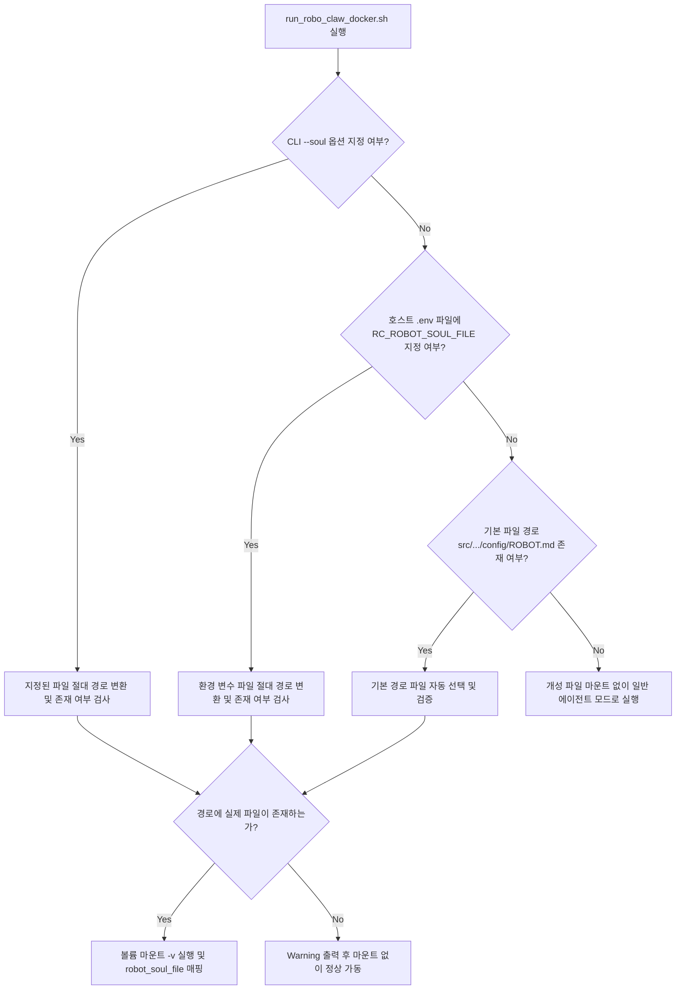

# RoboClaw Docker 가이드 (실행·이미지 빌드)

Docker 환경에서 RoboClaw를 구동하고 이미지를 빌드하는 두 가지 절차를 다룹니다.

| 작업             | 도구                      | 문서 위치     |
| ---------------- | ------------------------- | ------------- |
| 컨테이너 실행    | `run_robo_claw_docker.sh` | 이 문서 1~5장 |
| 이미지 빌드·푸시 | `task docker-*` 태스크    | 이 문서 6~8장 |

---

## 1. 개요

`run_robo_claw_docker.sh`는 로컬 호스트 환경의 복잡한 ROS 2 설정이나 린트, 라이브러리 의존성 충돌 없이 Docker 컨테이너 상에서 RoboClaw 핵심 에이전트와 채널 노드를 즉시 실행하는 유틸리티 스크립트입니다. 스크립트는 다음 환경을 자동으로 구성합니다.

- **X11 GUI 포워딩**: 시뮬레이션 뷰어(RViz 등)를 호스트 화면에 투사할 수 있도록 디스플레이 소켓 마운트와 접속 권한 부여를 처리합니다.
- **장치 접근 권한**: `--privileged` 모드와 `/dev` 볼륨 매핑으로 카메라, 라이다 등 물리 하드웨어 접근을 지원합니다.
- **환경 변수 자동 연동**: 호스트 작업공간 루트의 `.env` 파일을 파싱해 컨테이너 환경과 ROS launch 인자로 자동 전달합니다.
- **볼륨 공유**: 모델 데이터, 로봇 개성 파일(`ROBOT.md`), Butler 로봇 스크립트, 커스텀 설정 폴더를 동적으로 마운트해 컨테이너 재빌드 없이 변경 사항을 즉시 반영합니다.

---

## 2. 실행 스크립트 옵션

| 옵션명                            | 값 타입   | 설명                                                                                                     | 기본값                                    |
| :-------------------------------- | :-------- | :------------------------------------------------------------------------------------------------------- | :---------------------------------------- |
| `--robot-config`                  | `string`  | 로봇 설정 프로필을 지정합니다. (`stretch3` \| `former` \| `butler` \| `cloid` \| `sim`)                | `sim`                                     |
| `--camera-topic`                  | `string`  | 카메라 이미지 토픽을 수동으로 재정의(override)합니다.                                                    | 로봇 프로필 기본값                        |
| `--soul` / `--soul-file`          | `path`    | 로봇 에이전트의 개성·핵심 지침이 담긴 마크다운 파일 경로를 지정합니다.                                   | `.env` 설정 또는 기본 파일                |
| `--skills-guide` / `--guide-file` | `path`    | 로봇 에이전트의 스킬 동작 가이드 마크다운 파일 경로를 지정합니다.                                        | `.env` 설정 또는 기본 파일                |
| `--robot-limits`                  | `path`    | 로봇의 물리 구동 제약 규격(`ROBOT_LIMITS.json`) 호스트 파일 경로를 지정합니다.                           | `.env` 설정 또는 기본 파일                |
| `--troubleshooting`               | `path`    | 로봇 예외 상황 조치 가이드(`TROUBLESHOOTING.md`) 호스트 파일 경로를 지정합니다.                          | `.env` 설정 또는 기본 파일                |
| `--butler-scripts`                | `path`    | Butler 로봇 쉘 스크립트 폴더의 호스트 경로를 지정합니다.                                                 | `.env` 설정 또는 기본 경로                |
| `--agent-workspace`               | `path`    | 에이전트 전용 작업 공간 폴더의 호스트 경로를 지정합니다. (컨테이너 내 `/ros2_ws/agent_workspace`로 연동) | `.env` 설정 또는 `$(pwd)/agent_workspace` |
| `--config-dir`                    | `path`    | `robo_claw_bringup` 설정 폴더의 호스트 경로를 지정합니다.                                                | `src/robo_claw_bringup/config`            |
| `--grpc` / `--use-grpc`           | 없음      | gRPC 제어 노드(`robo_claw_grpc_node`)를 함께 실행합니다.                                                 | `false`                                   |
| `--vision` / `--use-vision`       | 없음      | ONNX 기반 객체 감지 비전 노드(`object_detector_node`)를 함께 실행합니다.                                 | `false`                                   |
| `--`                              | 복수 인자 | `--` 이후의 모든 명령은 도커 컨테이너 내부 셸에서 직접 위임 실행됩니다.                                  | ROS 2 기본 런치                           |

---

## 3. 설정 파일 경로 결정 우선순위

스크립트는 개성 파일(`ROBOT.md`), 스킬 가이드, 물리 제약 규격, 장애 조치 가이드 파일을 탐지해 컨테이너 내부에 볼륨 바인딩(예: `-v 호스트_개성_경로:/ros2_ws/config/ROBOT.md:ro`)한 뒤 launch 인자로 연동합니다.



> 상대 경로로 개성 파일 인자를 주어도(예: `--soul ./test_soul.md`) 스크립트 내부에서 호스트 기준 절대 경로(`realpath`)로 변환해 볼륨 마운트 오류를 막습니다. 경로에 파일이 없으면 컨테이너가 종료되지 않고 `Warning`을 출력한 뒤 마운트 없이 안정적으로 실행됩니다.

---

## 4. 환경 변수(`.env`) 매핑 규칙

작업공간 루트의 `.env` 파일이 있으면 스크립트가 실행될 때 자동으로 파싱되며, 아래 변수들은 컨테이너 내부의 ROS launch 파라미터로 번역됩니다.

- `RC_LLM_PROVIDER` ➡️ `llm_provider` (예: `ollama`, `azure`, `openai`)
- `RC_LLM_MODEL` ➡️ `llm_model` (예: `gpt-4o`, `gemma4:e4b`)
- `RC_LLM_EMBEDDING_MODEL` ➡️ `llm_embedding_model`
- `RC_ENABLE_RAG` ➡️ `enable_rag` (`true`/`false`)
- `RC_RAG_VECTOR_BACKEND` ➡️ `rag_vector_backend` (`qdrant`)
- `RC_RAG_TOP_K` ➡️ `rag_top_k`
- `RC_RAG_SCORE_THRESHOLD` ➡️ `rag_score_threshold`
- `QDRANT_URL` ➡️ `qdrant_url`
- `RC_QDRANT_COLLECTION` ➡️ `qdrant_collection`
- `RC_QDRANT_TIMEOUT_SEC` ➡️ `qdrant_timeout_sec`
- `RC_BUTLER_SCRIPTS_DIR` ➡️ 호스트의 Butler 스크립트 경로 마운트
- `RC_AGENT_WORKSPACE_DIR` ➡️ 에이전트 작업 공간 경로 마운트 (컨테이너 내 `/ros2_ws/agent_workspace` + `agent_workspace_dir` 파라미터)
- `RC_SKILLS_GUIDE_FILE` ➡️ 스킬 가이드 파일 마운트 (컨테이너 내 `/ros2_ws/config/SKILLS.md`)
- `RC_ROBOT_LIMITS_FILE` ➡️ 물리 제약 규격 파일 마운트 (컨테이너 내 `/ros2_ws/config/ROBOT_LIMITS.json`)
- `RC_TROUBLESHOOTING_GUIDE_FILE` ➡️ 장애 조치 가이드 파일 마운트 (컨테이너 내 `/ros2_ws/config/TROUBLESHOOTING.md`)
- `RC_CONFIG_DIR` ➡️ 커스텀 설정 폴더 마운트
- `RC_ENABLE_MCP` ➡️ `mcp_enabled` (`true`/`false`)
- `RC_MCP_SERVERS_JSON` ➡️ `mcp_servers_json`

---

## 5. 실행 예시

### 1) 기본 구동

별도 인자 없이 구동하면 `.env` 설정과 프로젝트 기본 개성 파일(`ROBOT.md`)이 주입되어 채널 노드와 함께 실행됩니다.

```bash
./scripts/run_robo_claw_docker.sh
```

### 2) 커스텀 개성·제약·장애 조치 파일 지정

```bash
./scripts/run_robo_claw_docker.sh --soul ./custom_soul.md --robot-limits ./custom_limits.json --troubleshooting ./custom_trouble.md
```

### 3) gRPC·비전 활성화 및 Stretch3 프로필 구동

```bash
./scripts/run_robo_claw_docker.sh --robot-config stretch3 --grpc --vision
```

### 4) 에이전트 전용 작업 공간 마운트

```bash
./scripts/run_robo_claw_docker.sh --agent-workspace ./custom_agent_workspace
```

### 5) 컨테이너 내부 명령 직접 위임 실행

```bash
./scripts/run_robo_claw_docker.sh -- ros2 topic list
```

---

## 6. 이미지 빌드 개요

AMD64(x86_64)와 ARM64(aarch64)를 동시에 지원하는 이미지를 빌드·푸시하는 절차입니다. 빌드/확인 명령은 `Taskfile.yml`의 `docker-*` 태스크로 감싸져 있습니다.

```bash
task docker-setup          # QEMU binfmt 에뮬레이터 등록 (호스트에 1회)
task docker-buildx-check   # 출력에 linux/arm64 가 보이면 OK
```

`docker-buildx-check`가 실패하면 `task docker-buildx-recreate`으로 빌더를 새로 만들어 부트스트랩합니다(`docker buildx create --name multiarch --driver docker-container --use`와 동일).

### 파이썬 의존성 고정

이미지의 파이썬 패키지는 `Dockerfile`의 `pip3 install` 목록으로 설치되며, 개발 환경(`uv.lock`)과는 별도로 해석됩니다. 버전 범위가 어긋나면 개발 환경과 배포 이미지의 런타임 API가 달라질 수 있으므로 다음 규칙을 유지합니다.

- `Dockerfile`과 `pyproject.toml`에 모두 있는 패키지는 버전 범위를 동일하게 유지합니다.
- API에 민감한 패키지(예: `mcp`)는 `Dockerfile`에서 `uv.lock`과 같은 버전으로 정확히 고정(`==<version>`)합니다.
- 이미지 전용 패키지는 사유와 함께 `scripts/check_docker_deps.py`의 `DOCKER_ONLY`에 등록합니다.

검증은 다음 명령으로 수행하며 `task lint`에 포함되어 있습니다.

```bash
task deps-check
```

---

## 7. 빌드 + push

`task docker-build`는 현재 git 커밋 해시를 기본 `TAG`으로 사용합니다. 불변 태그 권장(`:latest` 캐시 함정 방지 — `TAG=20260807 task docker-build TAG=$TAG`처럼 덮어쓸 수 있습니다).

```bash
TAG=20260807 task docker-build TAG=$TAG
```

실행되는 실제 명령:

```bash
docker buildx build --platform=linux/amd64,linux/arm64 \
  --build-arg BUILD_DATE="$(date +'%Y-%m-%d %H:%M:%S %Z')" \
  --build-arg GIT_COMMIT="$(git rev-parse --short HEAD)" \
  --build-arg IMAGE_TAG="$TAG" \
  -t lgecloudroboticstask/robo-claw:latest \
  -t lgecloudroboticstask/robo-claw:$TAG . --push
```

- `--push`이므로 도커 레지스트리에 로그인(`docker login`)되어 있어야 합니다.
- 로컬 테스트만 급하면 `task docker-build-local`로 AMD64 전용(`--load`, push 없음)을 먼저 돌리세요. 로컬 빌드는 `:latest`와 `<hash>`를 함께 태그하므로, 빌드 직후 별도 `--image-tag` 없이 `./rclaw launch <robot> <env> --docker`를 실행하면 방금 빌드한 로컬 이미지를 사용합니다. 이미지를 특정하려면 `--image-tag <hash>`로 고정하세요.
- arm64는 QEMU 에뮬레이션이라 colcon/cmake 컴파일 + onnxruntime(aarch64) 다운로드까지 있어 AMD64보다 몇 배 오래 걸립니다. 정상이니 기다리세요.

### 버전 배너 (실행 이미지 식별)

`--build-arg`로 넣은 빌드 날짜·git 커밋·태그는 이미지에 구워지고(`/etc/robo_claw_version`) 컨테이너 시작 로그 최상단에 배너로 출력됩니다:

```text
===== RoboClaw image =====
build_date=2026-08-07 15:12:33 KST
git_commit=979b821
image_tag=20260807
==========================
```

즉시 확인:

```bash
docker exec robo_claw_container cat /etc/robo_claw_version
```

→ "지금 로봇에서 도는 이미지가 방금 빌드한 그것인지"를 이 값으로 판별합니다. build-arg를 생략하면 각 값은 `unknown`으로 표시되며, `run_robo_claw_docker.sh`로 빌드하면 자동 주입됩니다.

---

## 8. 이미지 빌드 트러블슈팅

### exec format error 반복

에뮬레이터를 등록했는데도 재발하면 빌더가 새 binfmt를 못 잡은 경우입니다.

```bash
task docker-buildx-recreate
```

### QEMU 세그폴트 (`qemu: uncaught target signal 11 (Segmentation fault)`)

에뮬레이션의 산발적 불안정성입니다. 대응:

1. binfmt 재설치 후 재시도:

   ```bash
   docker run --privileged --rm tonistiigi/binfmt --uninstall 'qemu-*' && \
   docker run --privileged --rm tonistiigi/binfmt --install arm64
   ```

2. 그래도 실패하면 **로봇(arm64)에서 네이티브 빌드**가 가장 확실합니다(에뮬레이션 없음).

   ```bash
   # 로봇에 최신 소스 동기화 후, Dockerfile이 있는 저장소 루트에서
   TAG=<tag> task docker-build-native TAG=$TAG
   ```

   네이티브 빌드도 `:latest`와 `<hash>`를 함께 태그하므로, 이후 `./rclaw launch <robot> <env> --docker`(기본 태그 `latest`)를 그대로 실행할 수 있습니다.

### push 실패

레지스트리 로그인이 필요합니다(`docker login`). `--push` 단계에서 별도로 실패합니다.
