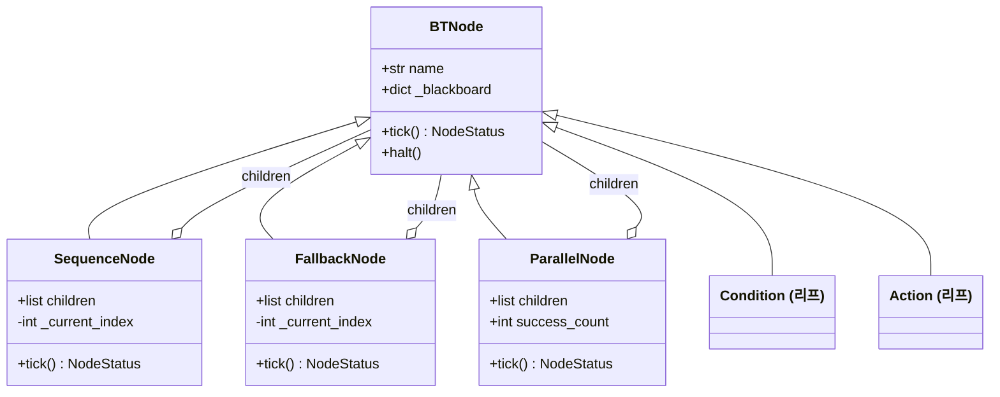
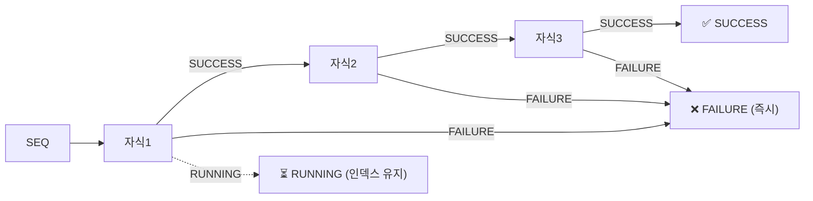
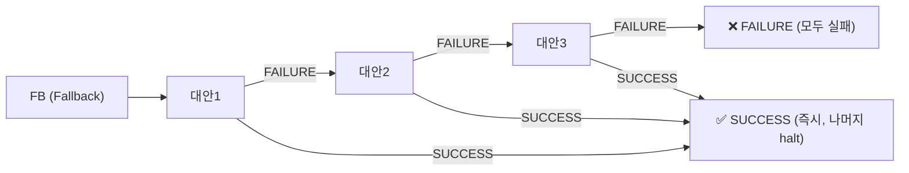
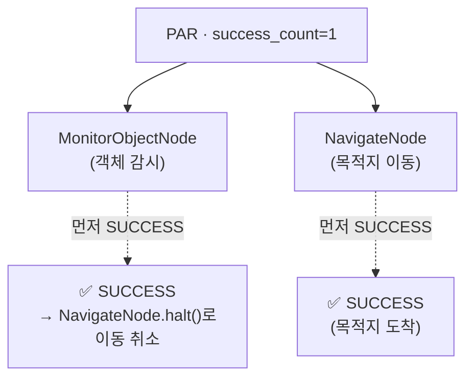

# 01 · BT 엔진 코어

> 소스: `skills/autonomous_skill/core.py`, `bt_runner.py`, `globals.py`

RoboClaw의 BT 엔진은 외부 라이브러리(py_trees, BehaviorTree.CPP 등) 없이 약 120줄의 순수
Python으로 구현된 경량 엔진입니다. 이 문서는 노드 타입과 `tick()` 의미론을 정확히 설명합니다.

---

## 1. NodeStatus — 노드 실행 결과

모든 노드의 `tick()`은 세 가지 상태 중 하나를 반환합니다.

```python
class NodeStatus(enum.Enum):
    SUCCESS = "SUCCESS"   # 작업 완료 / 조건 참
    FAILURE = "FAILURE"   # 작업 실패 / 조건 거짓
    RUNNING = "RUNNING"   # 진행 중 (다음 tick에서 이어감)
```

```
   ┌──────────┐        ┌──────────┐        ┌──────────┐
   │ SUCCESS  │        │ FAILURE  │        │ RUNNING  │
   │  ✅ 성공  │        │  ❌ 실패  │        │  ⏳ 진행중 │
   └──────────┘        └──────────┘        └──────────┘
   조건 참 / 완료       조건 거짓 / 실패      비동기 작업 대기
```

---

## 2. BTNode — 기반 클래스

```python
class BTNode:
    def __init__(self, name: str) -> None:
        self.name = name
        self._blackboard: dict[str, Any] = {}   # 트리 전체가 공유하는 상태 저장소

    def tick(self) -> NodeStatus:
        raise NotImplementedError

    def halt(self) -> None:
        """노드 중단 처리 (예: 실행 중인 Nav2 액션 취소)"""
        pass
```

- `_blackboard` — 트리 내 모든 노드가 **하나의 dict**를 공유합니다. `wire_blackboard()`(후술)가
  트리 조립 후 모든 노드에 같은 dict를 주입합니다. 노드 간 통신은 전적으로 이 Blackboard를 통해 이뤄집니다.
- `halt()` — 상위 제어 노드가 자식 실행을 취소할 때 호출됩니다. `NavigateNode`/`ExploreNode`는
  이때 진행 중인 Nav2 goal을 `cancel_goal_async()`로 취소합니다.

### 클래스 계층



---

## 3. SequenceNode (순차, 논리 AND)

> 모든 자식이 SUCCESS여야 SUCCESS. 첫 FAILURE/RUNNING에서 즉시 반환.

```python
def tick(self) -> NodeStatus:
    while self._current_index < len(self.children):
        child = self.children[self._current_index]
        status = child.tick()
        if status == NodeStatus.SUCCESS:
            self._current_index += 1      # 다음 자식으로
            continue
        if status == NodeStatus.RUNNING:
            return NodeStatus.RUNNING      # 현재 자식에서 멈춤 (인덱스 유지)
        self.halt()                        # FAILURE → 전체 중단
        return NodeStatus.FAILURE
    self._current_index = 0                # 모두 성공 → 인덱스 리셋
    return NodeStatus.SUCCESS
```

**메모리(memory) 시퀀스**: `_current_index`를 유지하므로, `RUNNING`을 반환한 자식은 다음 tick에서
**다시 그 자식부터** 이어서 실행합니다(처음부터 재시작하지 않음). 반응형 트리에서 이동 노드가
`RUNNING`인 동안 앞선 조건들을 재평가하지 않는 효과가 있습니다.



---

## 4. FallbackNode (선택/폴백, 논리 OR)

> 첫 SUCCESS에서 즉시 반환. 모두 FAILURE면 FAILURE.

```python
def tick(self) -> NodeStatus:
    while self._current_index < len(self.children):
        child = self.children[self._current_index]
        status = child.tick()
        if status == NodeStatus.SUCCESS:
            self.halt()                     # 성공 → 나머지 자식 halt + 인덱스 리셋
            return NodeStatus.SUCCESS
        if status == NodeStatus.RUNNING:
            return NodeStatus.RUNNING
        self._current_index += 1            # FAILURE → 다음 대안 시도
    self._current_index = 0
    return NodeStatus.FAILURE
```

**우선순위 분기**에 쓰입니다. 이 코드베이스의 대표 관용구:

- `SafetyGate = Fallback[CheckBatterySufficient, EmergencyLowBattery]`
  → 배터리 충분하면 성공(통과), 부족하면 비상 처리 노드로 폴백.
- `PerCycleGuarded = Fallback[PerCycleWork, CycleDone(항상 SUCCESS)]`
  → 사이클 작업이 일시 실패(카메라 타임아웃 등)해도 항상 SUCCESS로 감싸 **세션 전체가 죽지 않게** 방어.
- `ActOnInteresting = Fallback[DecideAndAct, Done(항상 SUCCESS)]`
  → 특이사항 없으면 `DecideAndAct`가 게이트에서 실패 → `Done`으로 폴백해 조용히 다음 사이클.



---

## 5. ParallelNode (병렬)

> 자식들을 매 tick마다 모두 실행. `success_count`개가 성공하면 SUCCESS 후 나머지 halt.

```python
def __init__(self, name, children, success_count: int = 1): ...

def tick(self) -> NodeStatus:
    successes = 0
    failures = 0
    for child in self.children:
        status = child.tick()               # 매 tick 모든 자식 실행
        if status == NodeStatus.SUCCESS:
            successes += 1
        elif status == NodeStatus.FAILURE:
            failures += 1

    if successes >= self.success_count:
        self.halt()                          # 임계 달성 → 나머지 자식 취소
        return NodeStatus.SUCCESS
    if failures > (len(self.children) - self.success_count):
        self.halt()
        return NodeStatus.FAILURE
    return NodeStatus.RUNNING
```

`success_count=1`(기본)이면 **"자식 중 하나라도 먼저 끝나면 승리"** 의미가 됩니다.
반응형 스킬에서 `Parallel[MonitorObjectNode, NavigateNode]` 형태로 쓰여
"이동을 계속하면서(RUNNING) 객체가 감지되면(SUCCESS) 즉시 이동을 취소(halt)"하는
반응형 인터럽트를 구현합니다. ([03 문서](03-reactive-skills.md) 참고)



---

## 6. 실행 헬퍼 (`bt_runner.py`)

트리를 조립·구동하는 세 함수입니다.

```python
def start_bt_thread(run_fn) -> threading.Thread:
    """BT 루프 함수를 데몬 스레드로 시작 (에이전트 메인 스레드 블로킹 방지)."""
    thread = threading.Thread(target=run_fn, daemon=True)
    thread.start()
    return thread

def wire_blackboard(nodes, blackboard) -> None:
    """트리 조립 후, 모든 노드에 '하나의' 공유 blackboard dict를 주입."""
    for n in nodes:
        if hasattr(n, "_blackboard"):
            n._blackboard = blackboard

def run_reactive_tick_loop(root, active_event, *, log_prefix, interval_sec=0.5):
    """RUNNING이 아니면 종료하는 표준 tick 루프 (반응형 스킬 전용)."""
    while active_event.is_set():
        status = root.tick()
        if status != NodeStatus.RUNNING:      # SUCCESS/FAILURE면 트리 종료
            break
        time.sleep(interval_sec)              # 0.5초 간격 tick
```

> ⚠️ **주의**: `autonomous_act`의 patrol/goal 루프는 `run_reactive_tick_loop`을 쓰지 **않습니다**.
> 이 두 모드는 자체 `while` 루프에서 매 사이클 root를 **한 번씩** tick하고, `SleepBetweenCycles`
> 노드가 사이클 간격을 담당합니다. `run_reactive_tick_loop`은 `reactive_navigate`/
> `condition_reactive`처럼 트리가 한 번 완결되면 끝나는 반응형 스킬에서만 사용됩니다.

### tick 루프 방식 비교

```
[ autonomous_act (patrol/goal) ]          [ 반응형 스킬 (run_reactive_tick_loop) ]
  while _AUTONOMOUS_ACTIVE:                  while _AUTONOMOUS_ACTIVE:
    cycle_count += 1                           status = root.tick()
    status = root.tick()   ← 1사이클 1틱        if status != RUNNING: break  ← 완결 시 종료
    if status == FAILURE: break                sleep(0.5s)
    (SleepBetweenCycles가 대기 담당)
```

---

## 7. 전역 제어 플래그 (`globals.py`)

```python
_AUTONOMOUS_ACTIVE = threading.Event()   # 자율/반응형 루프 활성 플래그
_SLEEP_WAKE        = threading.Event()   # SleepBetweenCycles 즉시 깨우기용
```

- `_AUTONOMOUS_ACTIVE` — `AutonomousActSkill`/`ReactiveNavigateSkill`/`ConditionReactiveSkill`이
  시작 시 `.set()`, 종료 시 `.clear()`. **동시에 하나의 자율/반응형 루프만** 실행되도록 상호 배제 역할도 합니다.
- `_SLEEP_WAKE` — `stop_autonomous`가 이 이벤트를 `.set()`하면 `SleepBetweenCycles`가 대기
  타임아웃을 기다리지 않고 **즉시 깨어나** 루프가 빠르게 종료됩니다.
- (별도) `PATROL_ACTIVE` — 단순 순찰 스킬(`navigation_skill/patrol.py`)용 플래그로, BT와는 무관한
  독립 스레드 루프입니다. ([02 문서 §5](02-autonomous-act.md) 참고)

다음: [02 · autonomous_act 트리 →](02-autonomous-act.md)
