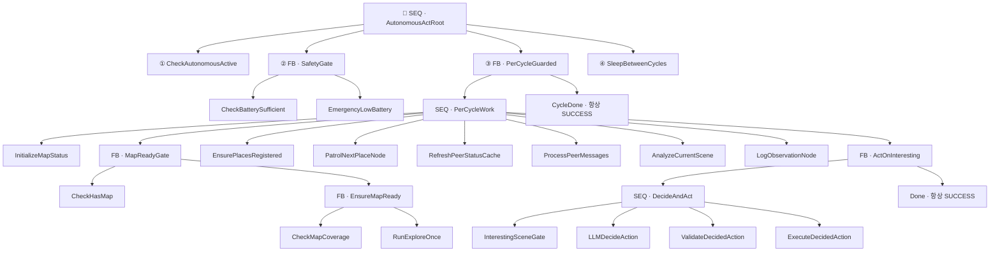
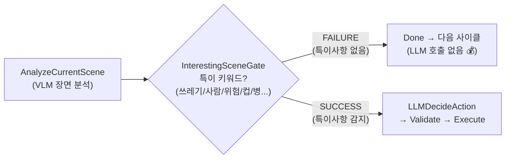
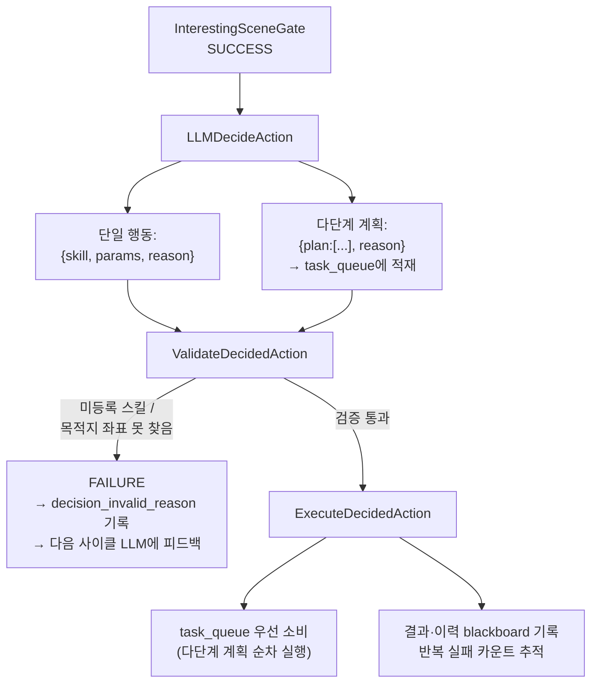
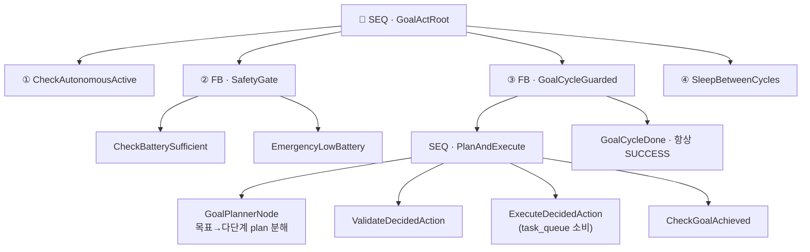

# 02 · `autonomous_act` 트리

> 소스: `skills/autonomous_skill/skill.py`(`AutonomousActSkill`),
> `conditions.py`, `environment_nodes.py`, `patrol_nodes.py`, `decision_nodes.py`, `execution_nodes.py`

`autonomous_act`는 "스스로 판단해서 행동해" 명령을 받아 백그라운드 데몬 스레드에서 BT 루프를
돌리는 핵심 자율 행동 스킬입니다. 두 가지 모드가 있습니다.

| 모드              | 파라미터                    | 동작                                                                                      | 트리 빌더              |
| ----------------- | --------------------------- | ----------------------------------------------------------------------------------------- | ---------------------- |
| **patrol** (기본) | `mode="patrol"`             | 지도 부족 시 탐험 → 등록 장소 순찰 → 장면 분석 → 특이사항 발생 시 LLM이 대응 결정         | `_build_patrol_loop()` |
| **goal**          | `mode="goal"`, `goal="..."` | 자연어 목표를 LLM이 다단계 plan으로 분해 후 순차 실행. 자신이 못하는 단계는 동료에게 위임 | `_build_goal_loop()`   |

## 파라미터 (기본값)

| 파라미터                | 기본값     | 설명                                                                          |
| ----------------------- | ---------- | ----------------------------------------------------------------------------- |
| `mode`                  | `"patrol"` | `"patrol"` 또는 `"goal"`                                                      |
| `goal`                  | `""`       | `mode="goal"`일 때 필수 — 자연어 목표                                         |
| `min_battery_pct`       | `20.0`     | 이 아래로 떨어지면 안전 종료                                                  |
| `allow_unknown_battery` | `True`     | 배터리 신호 부재 시 경고만 하고 루프 유지                                     |
| `check_only_battery`    | `True`     | `True`면 배터리 부족해도 체크만 수행(세션 유지), `False`면 저배터리 세션 종료 |
| `min_coverage_pct`      | `40.0`     | 지도 탐사율이 이 미만이면 탐험 수행                                           |
| `exploration_radius`    | `3.0`      | 한 번에 탐험할 프론티어 반경(m)                                               |
| `cycle_interval_sec`    | `3.0`      | 사이클 간 대기                                                                |
| `max_cycles`            | `0`        | 최대 사이클 수 (0=무제한)                                                     |
| `has_map`               | `None`     | 지도 존재 여부 (None=자동 판별)                                               |

---

## 1. patrol 모드 — 전체 트리

`_build_patrol_loop()`이 조립하는 트리입니다. 매 사이클 root를 한 번 tick합니다.



### 루트 구조의 3중 방어 설계

```
SEQ AutonomousActRoot          "안전이 먼저, 작업은 죽지 않게, 사이클마다 쉰다"
├─ ① CheckAutonomousActive     stop_autonomous 호출 시 FAILURE → 루트 FAILURE → 루프 종료
├─ ② FB SafetyGate             배터리 상태 점검 (check_only=True 기본: 상태 기록/경고 후 세션 유지, check_only=False 시 저배터리에서 루트 종료)
├─ ③ FB PerCycleGuarded        실제 작업. 실패해도 CycleDone(SUCCESS)로 감싸 세션 유지
└─ ④ SleepBetweenCycles        cycle_interval_sec 대기 (stop 시 즉시 깨어남)
```

- **①/②만 세션을 끝낼 수 있습니다.** 즉 "중단 명령" 또는 "저배터리(check_only=False 설정 시)"에서만 루프가 죽습니다. 기본 모드(`check_only_battery=True`)에서는 시험용 로봇 환경을 고려해 배터리 신호가 없거나 부족해도 경고만 기록하고 세션을 유지합니다.
- **③은 절대 세션을 끝내지 않습니다.** 카메라 타임아웃·LLM 파싱 오류 같은 일시적 실패가
  자율 행동 전체를 멈추면 안 되므로 `Fallback[작업, 항상성공]`으로 방어합니다.

### 구동 루프 (`_build_patrol_loop` 내부 while)

```python
while _AUTONOMOUS_ACTIVE.is_set():
    blackboard["cycle_count"] += 1
    if max_cycles > 0 and cycle > max_cycles:
        break                          # 최대 사이클 도달
    status = root.tick()               # 1사이클 = root 1틱
    if status == NodeStatus.FAILURE:   # ① 중단 or ② 저배터리
        break
_AUTONOMOUS_ACTIVE.clear()
```

---

## 2. PerCycleWork 시퀀스 — 한 사이클의 9단계

`PerCycleWork`는 매 사이클 순서대로 실행되는 9개 노드의 Sequence입니다.
README 최상위의 "BT 구조 (매 사이클)" 7단계 설명이 이 시퀀스에 해당합니다.

```
1. InitializeMapStatus        지도 존재 여부(has_map) 판별 → blackboard
2. MapReadyGate (FB)          지도 없으면 탐사율 확인 후 프론티어 탐험
       ├ CheckHasMap
       └ EnsureMapReady (FB)
             ├ CheckMapCoverage   (탐사율 >= 40% 면 통과)
             └ RunExploreOnce     (미달 시 프론티어 1곳 탐험)
3. EnsurePlacesRegistered     순찰할 장소가 없으면 시맨틱맵/RAG/지도발굴로 확보
4. PatrolNextPlaceNode         가장 오래 안 간 장소로 결정적 이동 (LLM 불필요)
5. RefreshPeerStatusCache      동료 로봇 배터리/위치 상태 주기적 캐싱 (60초)
6. ProcessPeerMessages         동료가 보낸 메시지를 수집해 LLM 판단에 "동료와의 최근 대화"로 주입
7. AnalyzeCurrentScene         VLM으로 현재 장면 분석 → blackboard
8. LogObservationNode          장면을 RAG에 자동 기록 (log_observation)
9. ActOnInteresting (FB)       특이사항 있으면 LLM 판단·실행, 없으면 조용히 통과
```

### 핵심 설계 ①: "결정적 순찰 + 조건부 LLM 개입"

정상적인 순찰 이동(4번)은 **LLM 없이** `PatrolNextPlaceNode`가 결정적으로 처리합니다.
등록된 장소 중 `last_seen`(마지막 방문 시각)이 가장 오래된 곳을 골라 이동하고, 방문 후
시각을 갱신해 자연히 라운드로빈 순환이 됩니다.

LLM(고비용)은 오직 9번 `ActOnInteresting`에서, 그리고 `InterestingSceneGate`가 통과했을 때만 호출됩니다.



`InterestingSceneGate`가 감지하는 키워드(`patrol_nodes.py`):

- **객체**: trash, garbage, waste, litter, bottle, can, cup, wrapper, bag, cigarette, spill, mess, person, human
- **텍스트**: 쓰레기, 어질러, 정리, 치워, 사람, 위험, 넘어, 쏟아, 고장

### 핵심 설계 ②: LLM 판단 → 검증 → 실행 파이프라인 (DecideAndAct)



- **`LLMDecideAction`** — 장면·감지객체·탐사율·최근 5사이클 이력·등록 장소·동료 목록·자기 능력을
  시스템 프롬프트로 조립해 LLM에게 다음 행동을 JSON으로 받습니다. 매니퓰레이션 능력이 없으면
  "동료에게 위임" 힌트를 강제 주입합니다. RAG 과거 관찰도 검색해 주입합니다.
- **`ValidateDecidedAction`** — 실행 전에 (a) 등록된 스킬인지, (b) 목적지가 좌표로 해석 가능한지
  검증. 무효하면 폐기하고 사유를 `decision_invalid_reason`에 남겨 다음 사이클 LLM에 피드백합니다.
- **`ExecuteDecidedAction`** — `task_queue`가 있으면 큐에서 하나 꺼내 실행(다단계 계획), 없으면
  단일 `decided_skill` 실행. 동일 (스킬,목적지) 반복 실패를 카운트해 2회 이상이면 LLM에 경고로 알립니다.

---

## 3. goal 모드 — 목표 지시형 트리

`mode="goal"`이면 `_build_goal_loop()`가 더 단순한 트리를 조립합니다.



- **`GoalPlannerNode`** — 첫 사이클에 목표를 LLM으로 다단계 `plan`으로 분해해 `task_queue`에 적재.
  이미 `task_queue`가 있으면 통과(재계획 안 함). 자신이 못하는 단계는 `delegate_task`/
  `call_peer_robot`을 plan 단계로 배치하도록 프롬프트에 명시됩니다.
- **`CheckGoalAchieved`** — `task_queue`가 비면 `goal_achieved=True`로 표시하고
  `_AUTONOMOUS_ACTIVE.clear()`로 루프를 종료합니다.

구동 루프는 patrol과 동일하되 `blackboard["goal_achieved"]`가 True가 되면 추가로 break합니다.

### goal 모드의 종료 판정

goal 모드에서 task queue가 비었다는 사실만으로 목표 달성으로 판정하지 않습니다.
플래너가 `goal_achieved=true`를 명시적으로 반환해야 성공하며, 빈 계획을 반환하거나
계획 수립 오류가 반복되면 제한된 재시도 후 안전하게 중단합니다. 실행 단계의 실패는
`queue_execution_failed`로 기록되어 목표 성공과 분리되고, 최근 실행 이력과 반복 실패
횟수는 다음 계획 수립에 전달됩니다.

> 배터리/안전 설정 파일(`ROBOT_LIMITS.json`, `TROUBLESHOOTING.md`)은
> [ROBOT_CONFIG.md](../ROBOT_CONFIG.md)를, 관찰 기록 저장 방식은
> [RAG_AND_LEARNING.md](../RAG_AND_LEARNING.md#5-탐험-관찰-로깅-log_observation)를 참고하세요.

---

## 4. 한 사이클 실행 시퀀스 다이어그램 (patrol)

```mermaid
sequenceDiagram
    participant Loop as 구동 while 루프
    participant Root as AutonomousActRoot(SEQ)
    participant Safe as SafetyGate(FB)
    participant Work as PerCycleWork(SEQ)
    participant LLM as LLMDecideAction
    participant SM as SkillManager

    Loop->>Root: tick() (cycle N)
    Root->>Root: CheckAutonomousActive → SUCCESS
    Root->>Safe: tick()
    Safe->>Safe: CheckBatterySufficient → SUCCESS
    Root->>Work: tick()
    Work->>Work: InitMap→MapGate→EnsurePlaces
    Work->>Work: PatrolNextPlace (결정적 이동)
    Work->>Work: RefreshPeer→PeerMessages→AnalyzeScene(VLM)→LogObs(RAG)
    Work->>Work: InterestingSceneGate?
    alt 특이사항 감지
        Work->>LLM: 다음 행동 결정 (JSON)
        LLM->>SM: ExecuteDecidedAction → skill 실행
    else 특이사항 없음
        Work-->>Work: Done (LLM 생략)
    end
    Root->>Root: SleepBetweenCycles (3s)
    Root-->>Loop: SUCCESS → 다음 사이클
```

---

## 5. ⚠️ `autonomous_act`(BT) vs `patrol`(단순 스레드) 구분

이름이 비슷해 혼동하기 쉬운 두 가지가 있습니다.

|             | `autonomous_act` patrol 모드      | `patrol` 스킬                           |
| ----------- | --------------------------------- | --------------------------------------- |
| 소스        | `autonomous_skill/` (BT)          | `navigation_skill/patrol.py`            |
| 구조        | Behavior Tree                     | 단순 `while` + `for` 스레드 루프        |
| 장소 선택   | `last_seen` 오래된 순 결정적 순환 | 사용자가 준 `waypoints` 리스트 순서대로 |
| 지능        | VLM 분석 + 조건부 LLM 대응        | 없음 (단순 방문)                        |
| 제어 플래그 | `_AUTONOMOUS_ACTIVE`              | `globals.PATROL_ACTIVE`                 |
| 중단        | `stop_autonomous`                 | `stop_patrol`                           |

`patrol` 스킬은 BT가 아니므로 이 문서군의 대상이 아닙니다(비교 목적으로만 언급).

---

## 6. 종료 (`stop_autonomous`)

`StopAutonomousSkill.execute()`:

```python
_AUTONOMOUS_ACTIVE.clear()   # ① 구동 루프 종료 조건
_SLEEP_WAKE.set()            # ② SleepBetweenCycles 즉시 깨움 (대기 스킵)
_cancel_active_goal()        # ③ 진행 중인 Nav2 목표 취소
```

세 가지가 함께 작동해, 대기 중이든 이동 중이든 **거의 즉시** 자율 행동이 멈춥니다.

다음: [03 · 반응형 스킬 →](03-reactive-skills.md)
