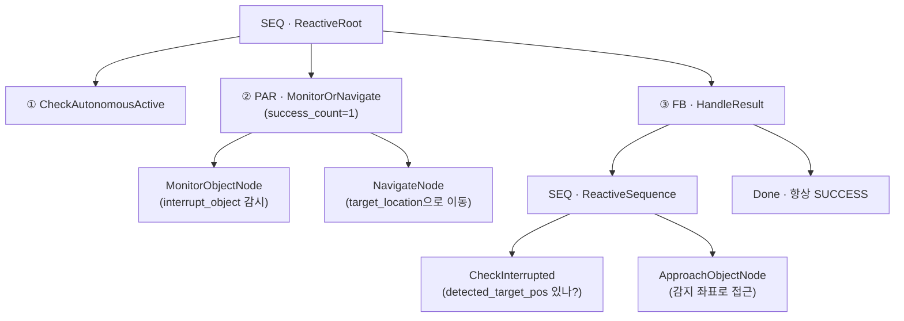
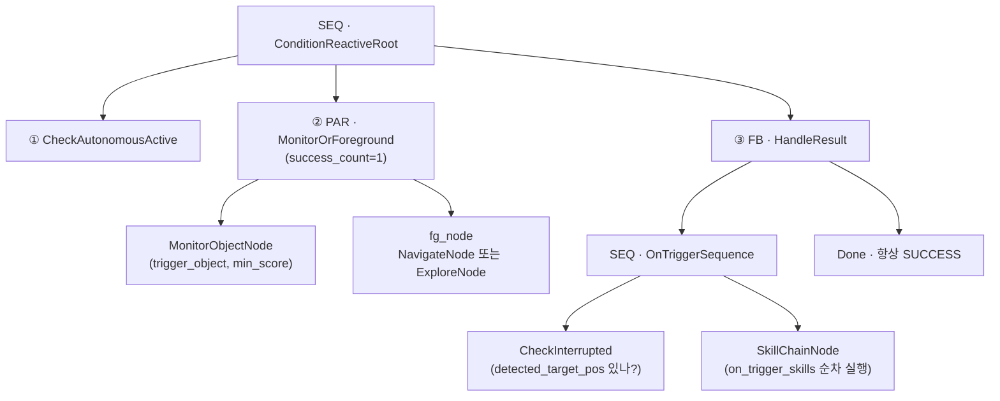
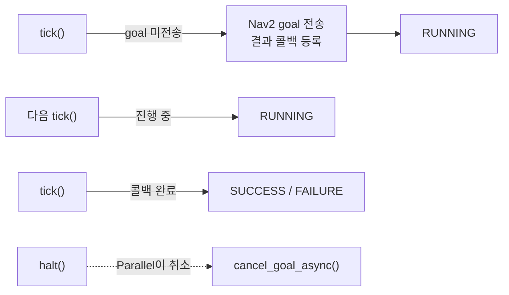

# 03 · 반응형 스킬 (Parallel 감시 트리)

> 소스: `skills/autonomous_skill/__init__.py`(`ReactiveNavigateSkill`, `ConditionReactiveSkill`),
> `navigation_nodes.py`, `perception_nodes.py`, `action_nodes.py`

반응형 스킬은 **"무언가를 하면서 동시에 감시하고, 조건이 맞으면 즉시 방향을 튼다"** 는
패턴을 `ParallelNode`로 구현합니다. `autonomous_act`와 달리 `run_reactive_tick_loop`
(0.5초 간격 tick)로 구동되며, 트리가 한 번 완결되면(SUCCESS/FAILURE) 종료됩니다.

두 스킬 모두 시작 전 `_AUTONOMOUS_ACTIVE`를 검사·설정하므로 `autonomous_act`와 상호 배타적이고,
`stop_autonomous`로 중단합니다.

---

## 1. 반응형 인터럽트의 원리

```
        ┌──────────────── PAR (success_count=1) ────────────────┐
        │                                                        │
        │   MonitorObjectNode          NavigateNode / ExploreNode│
        │   (객체 감시)                 (포그라운드 작업)          │
        │   ─ 미감지: RUNNING           ─ 이동중: RUNNING          │
        │   ─ 감지!: SUCCESS ───┐       ─ 도착: SUCCESS ───┐       │
        └───────────────────────┼──────────────────────────┼─────┘
                                 │                          │
                    먼저 SUCCESS 쪽이 승리 → 나머지 halt()   │
                                 │                          │
              ┌──────────────────▼─────────┐   ┌────────────▼──────────┐
              │ 객체 감지 → 이동 취소 후      │   │ 목적지 도착 (감지 없이)  │
              │ 반응 행동(접근/스킬체인) 실행 │   │ → 그냥 완료             │
              └────────────────────────────┘   └───────────────────────┘
```

`Parallel[Monitor, Foreground]`에서 감시 노드가 먼저 SUCCESS를 반환하면 Parallel이 SUCCESS가 되면서
`halt()`를 호출 → `NavigateNode.halt()`가 진행 중인 Nav2 goal을 취소합니다. 이것이 "이동을 즉시
중단하고 반응"하는 메커니즘입니다.

---

## 2. `reactive_navigate` — 이동 중 객체 발견 시 접근

> "거실로 가다가 사람을 보면 즉시 그쪽으로 접근해."

```python
params = {"target_location": "거실", "interrupt_object": "person"}
```



**흐름**:

1. `CheckAutonomousActive` 통과.
2. `MonitorOrNavigate` 병렬 실행 — 이동하면서 `person`을 감시.
   - **감지되면**: `MonitorObjectNode`가 좌표를 `blackboard["detected_target_pos"]`에 쓰고 SUCCESS →
     Parallel이 `NavigateNode.halt()`로 이동 취소.
   - **끝까지 미감지**: `NavigateNode`가 도착 SUCCESS → Parallel SUCCESS.
3. `HandleResult` 폴백:
   - `detected_target_pos`가 있으면 `ReactiveSequence`가 열려 `ApproachObjectNode`로 그 좌표에 접근.
   - 없으면(그냥 도착) `Done`으로 통과.

---

## 3. `condition_reactive` — 조건 트리거 시 스킬 체인 실행

`reactive_navigate`의 일반화 버전입니다. 포그라운드를 **이동 또는 탐험** 중 선택할 수 있고,
트리거 시 실행할 **임의의 스킬 체인**을 지정합니다.

> "탐험하다가 화분을 발견하면 접근한 뒤 사진을 찍어 전송해."

```python
params = {
    "foreground_task": "explore",              # "navigate" | "explore"
    "trigger_object": "potted plant",
    "on_trigger_skills": [
        {"skill": "approach_object", "params": {}},
        {"skill": "capture_camera_image", "params": {}},
    ],
    "min_score": 0.5,
}
```



`reactive_navigate`와 구조가 동일하되 두 가지가 다릅니다.

|                | `reactive_navigate`       | `condition_reactive`              |
| -------------- | ------------------------- | --------------------------------- |
| 포그라운드     | 이동(Navigate) 고정       | Navigate **또는** Explore 선택    |
| 트리거 후 행동 | `ApproachObjectNode` 고정 | `SkillChainNode`로 임의 스킬 체인 |

---

## 4. 반응형 트리를 구성하는 리프 노드

### MonitorObjectNode (`perception_nodes.py`)

`/object_detector_node/detections`(YOLO 결과)를 짧은 타임아웃(0.1s)으로 확인합니다.

```
미감지            → RUNNING  (계속 감시)
target 감지 &      → 카메라 픽셀 bearing + LiDAR(/scan) 거리로 map 좌표 추정
score >= min_score   → blackboard["detected_target_pos"] 저장 → SUCCESS
```

- 좌표는 **로봇 현재 pose + (bearing, distance) 극좌표** 로 추정합니다.
- LiDAR 거리를 못 구하면 `fallback_distance_m`(2.0m)로 임시 추정해, 최소한 "방향은 맞는" 좌표를
  만듭니다. (로봇 자기 위치를 물체 위치로 오인해 `ApproachObjectNode`가 제자리 이동하는 것을 방지)

### NavigateNode / ExploreNode / ApproachObjectNode (`navigation_nodes.py`)

비동기 Nav2 액션을 감싼 노드로, **`RUNNING`을 반환하며 결과 콜백으로 완료를 감지**합니다.



- `NavigateNode` — `target_location`(시맨틱맵/RAG 좌표 해석) 또는 `x,y`로 이동. 완료 전까지 RUNNING.
- `ExploreNode` — 프론티어를 찾아 순차 이동, 프론티어 소진 시 SUCCESS, 이동 중 RUNNING.
- `ApproachObjectNode` — `blackboard["detected_target_pos"]` 좌표로 `NavigateNode`를 만들어 접근.
- 세 노드 모두 `halt()`에서 진행 중 Nav2 goal을 `cancel_goal_async()`로 취소합니다.

### SkillChainNode (`action_nodes.py`)

`on_trigger_skills`의 스킬들을 **데몬 스레드에서 순차 실행**합니다. 실행 완료 전 RUNNING,
전부 성공 SUCCESS, 하나라도 실패 FAILURE.

```python
def tick(self):
    if self._thread is None:                       # 첫 tick에 스레드 시작
        self._thread = Thread(target=self._run_chain, daemon=True); ...
    if not self._done.is_set():
        return NodeStatus.RUNNING                   # 실행 중
    return SUCCESS if self._success else FAILURE
```

---

## 5. 세 반응형/자율 트리 비교표

|           | `autonomous_act`                  | `reactive_navigate`             | `condition_reactive`            |
| --------- | --------------------------------- | ------------------------------- | ------------------------------- |
| 루트      | `SEQ AutonomousActRoot`           | `SEQ ReactiveRoot`              | `SEQ ConditionReactiveRoot`     |
| 핵심 제어 | Fallback 방어 계층                | `PAR MonitorOrNavigate`         | `PAR MonitorOrForeground`       |
| 구동      | 자체 while + `SleepBetweenCycles` | `run_reactive_tick_loop` (0.5s) | `run_reactive_tick_loop` (0.5s) |
| 지속성    | 무한 사이클 (중단까지)            | 1회 완결 후 종료                | 1회 완결 후 종료                |
| LLM 사용  | O (조건부/계획)                   | X                               | X                               |
| 트리거 후 | 사이클 반복                       | 접근 후 종료                    | 스킬 체인 후 종료               |

다음: [04 · 노드 카탈로그 & Blackboard →](04-node-catalog.md)
