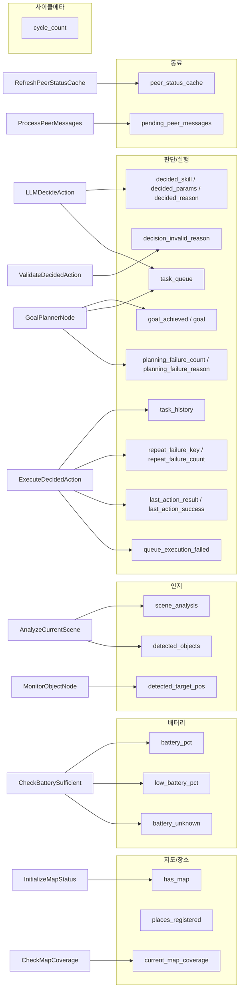
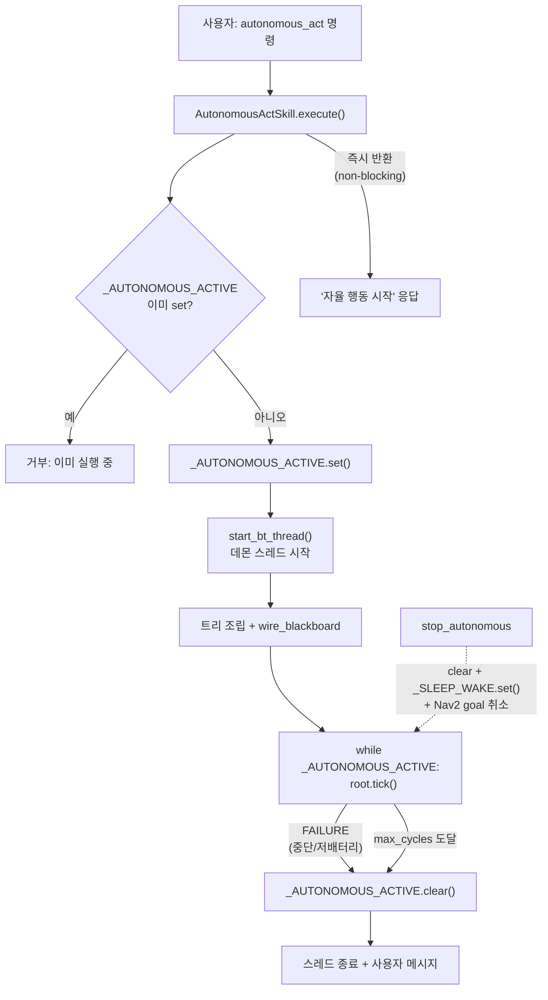

# 04 · 노드 카탈로그 & Blackboard

> 소스: `skills/autonomous_skill/` 전체

BT 트리를 구성하는 모든 노드의 목록, 노드 간 통신 매개체인 Blackboard 키, 그리고 스레딩/생명주기
모델을 정리합니다.

---

## 1. 제어 노드 (Composite)

| 노드           | 소스    | 의미                                                                   |
| -------------- | ------- | ---------------------------------------------------------------------- |
| `SequenceNode` | core.py | 모든 자식 SUCCESS → SUCCESS. 첫 FAILURE 즉시 실패. 메모리(인덱스) 유지 |
| `FallbackNode` | core.py | 첫 SUCCESS 즉시 성공. 모두 FAILURE → FAILURE                           |
| `ParallelNode` | core.py | 매 tick 모든 자식 실행, `success_count` 달성 시 SUCCESS + 나머지 halt  |

## 2. 조건 노드 (Condition · `conditions.py`)

| 노드                     | 판정                    | 읽는 Blackboard / 소스                      | 반환                                                                                             |
| ------------------------ | ----------------------- | ------------------------------------------- | ------------------------------------------------------------------------------------------------ |
| `CheckAutonomousActive`  | 자율 루프 활성 여부     | `_AUTONOMOUS_ACTIVE` 플래그                 | 활성=SUCCESS                                                                                     |
| `CheckBatterySufficient` | 배터리 ≥ `min_pct`(20%) | `/battery_state` 토픽 → 없으면 sysfs `BAT*` | 충분=SUCCESS, 신호부재/부족 시 check_only=True면 상태기록 후 SUCCESS, check_only=False면 FAILURE |
| `CheckMapCoverage`       | 탐사율 ≥ `min_pct`(40%) | `/map` OccupancyGrid                        | 충분=SUCCESS, 맵없음=FAILURE                                                                     |
| `CheckHasMap`            | 지도 존재 여부          | `blackboard["has_map"]`                     | 있음=SUCCESS                                                                                     |

## 3. 환경 인지 액션 (`environment_nodes.py`)

| 노드                     | 하는 일                                                      | Blackboard 쓰기                              |
| ------------------------ | ------------------------------------------------------------ | -------------------------------------------- |
| `InitializeMapStatus`    | `/map` 미탐사율(≤30%)로 `has_map` 판별 (파라미터 우선)       | `has_map`                                    |
| `EnsurePlacesRegistered` | 순찰 장소 확보: 시맨틱맵 → RAG 후보 → 지도 자동발굴 우선순위 | `places_registered`, `place_source_priority` |
| `RefreshPeerStatusCache` | 동료 로봇 배터리/위치 상태 60초 주기 백그라운드 캐싱         | `peer_status_cache`, `peer_status_cache_ts`  |
| `AnalyzeCurrentScene`    | VLM(`analyze_scene`)으로 장면 분석                           | `scene_analysis`, `detected_objects`         |
| `LogObservationNode`     | 장면을 RAG에 자동 기록(`log_observation`), 실패해도 SUCCESS  | —                                            |

## 4. 판단 액션 (`decision_nodes.py`)

| 노드                    | 하는 일                                                                                                             | Blackboard                                                                                                                                                                                            |
| ----------------------- | ------------------------------------------------------------------------------------------------------------------- | ----------------------------------------------------------------------------------------------------------------------------------------------------------------------------------------------------- |
| `ProcessPeerMessages`   | patrol 트리에 통합된 자율협동 노드(`cooperation_skill/bt_nodes.py`). 인박스에서 동료 메시지를 꺼내 대화 이력에 기록 | 쓰기: `pending_peer_messages` → LLMDecideAction이 "동료와의 최근 대화"로 주입                                                                                                                         |
| `LLMDecideAction`       | 상황·이력·장소·동료·능력을 프롬프트로 조립, LLM이 단일행동 또는 다단계 plan 결정                                    | 읽기: `scene_analysis`,`detected_objects`,`current_map_coverage`,`task_history`,`repeat_failure_count`,`pending_peer_messages` / 쓰기: `decided_skill`,`decided_params`,`decided_reason`,`task_queue` |
| `ValidateDecidedAction` | 실행 전 스킬 등록 여부·목적지 좌표 해석 가능 여부 검증                                                              | 실패 시 `decision_invalid_reason` 기록, 무효 결정 폐기                                                                                                                                                |
| `GoalPlannerNode`       | (goal 모드) 자연어 목표를 다단계 plan으로 분해                                                                      | `task_queue`, `goal_achieved`                                                                                                                                                                         |

## 5. 실행 액션 (`execution_nodes.py`)

| 노드                   | 하는 일                                                                                                                                 | 비고                 |
| ---------------------- | --------------------------------------------------------------------------------------------------------------------------------------- | -------------------- |
| `EmergencyLowBattery`  | check_only=True(기본) 시 경고 알림 후 SUCCESS 유지, check_only=False 시 저배터리에서 `_AUTONOMOUS_ACTIVE.clear()` → FAILURE로 루프 종료 | SafetyGate 폴백      |
| `RunExploreOnce`       | 프론티어 1곳을 blocking 이동(최대 60초). 프론티어 없으면 `has_map=True`                                                                 | explore_skill 재사용 |
| `ExecuteDecidedAction` | `task_queue` 우선 소비, 없으면 `decided_skill` 실행. 반복 실패 카운트 추적                                                              | 항상 SUCCESS 반환    |
| `SleepBetweenCycles`   | `cycle_interval_sec` 대기. `_SLEEP_WAKE`로 즉시 깨움                                                                                    | 사이클 간격          |
| `CheckGoalAchieved`    | (goal 모드) `task_queue` 비면 목표 달성 처리 후 루프 종료                                                                               | —                    |

## 6. 순찰/이동/감시/체인 액션

| 노드                   | 소스                | 하는 일                                                            |
| ---------------------- | ------------------- | ------------------------------------------------------------------ |
| `PatrolNextPlaceNode`  | patrol_nodes.py     | `last_seen` 가장 오래된 등록 장소로 결정적 이동, 방문 후 시각 갱신 |
| `InterestingSceneGate` | patrol_nodes.py     | 장면/객체에 특이 키워드 있을 때만 SUCCESS (LLM 개입 게이트)        |
| `NavigateNode`         | navigation_nodes.py | 좌표/장소로 Nav2 이동. 비동기 RUNNING, halt 시 취소                |
| `ExploreNode`          | navigation_nodes.py | 프론티어 순차 이동, 소진 시 SUCCESS                                |
| `ApproachObjectNode`   | navigation_nodes.py | `detected_target_pos` 좌표로 접근                                  |
| `MonitorObjectNode`    | perception_nodes.py | YOLO 감지 감시, 대상 감지 시 map 좌표 추정 후 SUCCESS              |
| `SkillChainNode`       | action_nodes.py     | 스킬 체인을 데몬 스레드에서 순차 실행                              |

---

## 7. Blackboard 키 전체 맵

Blackboard는 트리 전체가 공유하는 단일 dict입니다. 키별 생산자→소비자 관계:

| 키                                                 | 타입       | 생산자                                              | 소비자                                                    |
| -------------------------------------------------- | ---------- | --------------------------------------------------- | --------------------------------------------------------- |
| `cycle_count`                                      | int        | 구동 루프                                           | LLMDecideAction, ExecuteDecidedAction                     |
| `has_map`                                          | bool       | InitializeMapStatus / RunExploreOnce                | CheckHasMap, EnsurePlacesRegistered                       |
| `places_registered`, `place_source_priority`       | bool/str   | EnsurePlacesRegistered                              | (내부 캐시)                                               |
| `current_map_coverage`                             | float      | CheckMapCoverage                                    | LLMDecideAction                                           |
| `battery_pct`, `low_battery_pct`                   | float      | CheckBatterySufficient                              | EmergencyLowBattery                                       |
| `battery_unknown`                                  | bool       | CheckBatterySufficient                              | EmergencyLowBattery, LLMDecideAction                      |
| `scene_analysis`, `detected_objects`               | str/list   | AnalyzeCurrentScene                                 | InterestingSceneGate, LLMDecideAction, LogObservationNode |
| `detected_target_pos`                              | dict       | MonitorObjectNode                                   | CheckInterrupted, ApproachObjectNode                      |
| `decided_skill`/`decided_params`/`decided_reason`  | str/dict   | LLMDecideAction                                     | ValidateDecidedAction, ExecuteDecidedAction               |
| `task_queue`                                       | list       | LLMDecideAction / GoalPlannerNode                   | ExecuteDecidedAction, CheckGoalAchieved                   |
| `task_history`                                     | list       | ExecuteDecidedAction                                | LLMDecideAction (최근 5개 프롬프트 주입)                  |
| `decision_invalid_reason`                          | str        | ValidateDecidedAction                               | LLMDecideAction (재시도 피드백)                           |
| `repeat_failure_key`/`repeat_failure_count`        | str/int    | ExecuteDecidedAction                                | LLMDecideAction (반복 실패 경고)                          |
| `goal`/`goal_achieved`                             | str/bool   | (초기값)/GoalPlannerNode·CheckGoalAchieved          | 구동 루프 종료 판정                                       |
| `planning_failure_count`/`planning_failure_reason` | int/str    | GoalPlannerNode                                     | GoalPlannerNode (계획 실패 반복 제한, LLM 피드백)         |
| `queue_execution_failed`                           | bool       | ExecuteDecidedAction                                | CheckGoalAchieved (실행 실패와 목표 달성 분리)            |
| `last_action_result`/`last_action_success`         | dict/bool  | ExecuteDecidedAction                                | LLMDecideAction (직전 실행 결과 반영)                     |
| `peer_status_cache`/`peer_status_cache_ts`         | dict/float | RefreshPeerStatusCache                              | LLMDecideAction (위임 판단)                               |
| `pending_peer_messages`                            | list       | ProcessPeerMessages (cooperation_skill/bt_nodes.py) | LLMDecideAction (동료 대화 주입)                          |
| `patrol_last_place`/`patrol_last_success`          | str/bool   | PatrolNextPlaceNode                                 | (로깅/상태)                                               |

---

## 8. 스레딩 & 생명주기 모델

핵심 특성:

- **Non-blocking 시작**: `execute()`는 데몬 스레드를 띄우고 즉시 반환하므로, 에이전트는 자율 행동
  중에도 다른 명령을 받을 수 있습니다.
- **단일 실행 보장**: `_AUTONOMOUS_ACTIVE`가 자율/반응형 스킬 전체의 상호 배제 락 역할.
- **우아한 종료**: 세션 종료는 오직 루트 SEQ의 ①`CheckAutonomousActive` 또는 ②`SafetyGate`
  FAILURE, 혹은 `max_cycles` 도달로만 발생. 그 외 모든 하위 실패는 Fallback 방어막으로 흡수.
- **즉각 중단**: `stop_autonomous`는 플래그 clear + sleep wake + Nav2 취소를 동시에 수행.

---

## 9. 요약: BT가 해결하는 3가지 엔지니어링 문제

1. **비용 절감** — 정상 순찰은 결정적 로직(`PatrolNextPlaceNode`)으로 처리하고, LLM은
   `InterestingSceneGate` 통과 시에만 호출 → 토큰/지연 최소화.
2. **강건성(robustness)** — 일시적 실패(카메라·LLM·Nav2)를 `Fallback[작업, 항상성공]`으로 감싸
   장시간 자율 세션이 사소한 오류로 죽지 않게 함.
3. **반응성(reactivity)** — `ParallelNode`로 "작업 수행 + 이벤트 감시"를 동시에 하고 `halt()`로
   즉시 방향 전환 → 이동 중 인터럽트 같은 반응형 행동 구현.

---

← [README](README.md) · [01 엔진](01-bt-engine.md) · [02 autonomous_act](02-autonomous-act.md) · [03 반응형](03-reactive-skills.md)
