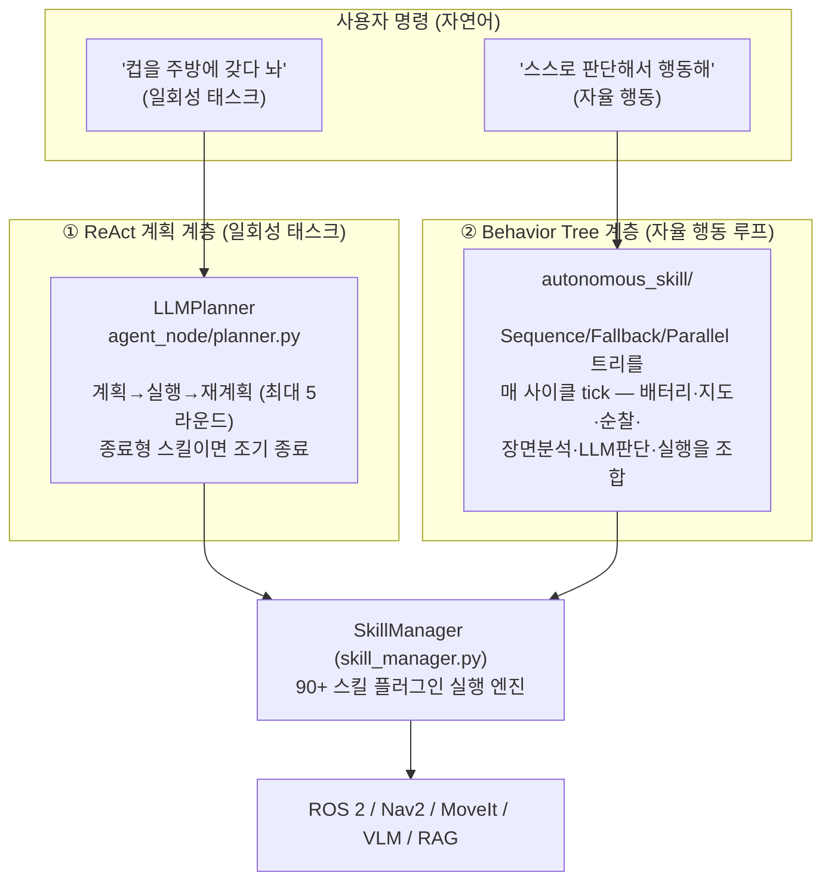
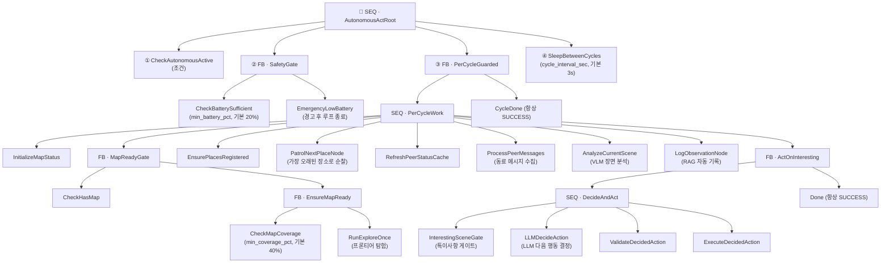

# RoboClaw Behavior Tree (행동 트리) 아키텍처

이 문서는 `robo-claw`의 **자율 행동 계층**을 구동하는 순수 Python **Behavior Tree(BT) 엔진**의
구조를 설명합니다. 게임 AI에서 널리 쓰이는 BT 패턴을 로봇 자율 행동에 적용한 것으로,
"스스로 판단해서 행동해" 같은 명령 한 마디로 탐험–관찰–판단–실행 루프를 시작합니다.

> 소스 위치: `src/robo_claw_agent/robo_claw_agent/skills/autonomous_skill/`

---

## 📑 문서 인덱스

| 문서                                           | 내용                                                                                  |
| ---------------------------------------------- | ------------------------------------------------------------------------------------- |
| **README.md** (이 문서)                        | 전체 개요, 2계층 아키텍처, 디렉토리 맵                                                |
| [01-bt-engine.md](01-bt-engine.md)             | BT 엔진 코어 — `NodeStatus`, `BTNode`, `Sequence`/`Fallback`/`Parallel`의 tick 의미론 |
| [02-autonomous-act.md](02-autonomous-act.md)   | `autonomous_act` 스킬의 순찰(patrol)/목표(goal) 모드 트리 전체 구조                   |
| [03-reactive-skills.md](03-reactive-skills.md) | 반응형 스킬 — `reactive_navigate`, `condition_reactive` (Parallel 감시 트리)          |
| [04-node-catalog.md](04-node-catalog.md)       | 전체 노드 카탈로그, Blackboard 키, 스레딩/생명주기 모델                               |

---

## 1. 큰 그림: 두 개의 "판단 계층"

RoboClaw 에이전트에는 명령을 처리하는 **두 가지 서로 다른 판단 메커니즘**이 있습니다.
BT는 그중 **자율 행동(장시간 백그라운드 루프)** 전용입니다.



| 구분      | ① ReAct 계획 계층                           | ② Behavior Tree 계층                                             |
| --------- | ------------------------------------------- | ---------------------------------------------------------------- |
| 위치      | `agent_node/planner.py` (`LLMPlanner`)      | `skills/autonomous_skill/`                                       |
| 트리거    | 모든 일회성 명령 (`ExecuteTask` 액션)       | `autonomous_act`, `reactive_navigate`, `condition_reactive` 스킬 |
| 제어 방식 | LLM이 매 라운드 다음 스킬 결정 (ReAct 루프) | 정적 트리 구조를 매 사이클 tick, LLM은 리프 노드로만 개입        |
| 실행 시간 | 짧음 (요청→응답)                            | 장시간 백그라운드 데몬 스레드                                    |
| 중단      | 태스크 완료 시                              | `stop_autonomous`로 명시적 중단                                  |

> **핵심**: 이 문서군이 다루는 "Behavior Tree"는 ②번 계층입니다. ①번 `LLMPlanner`는
> BT가 아니라 ReAct 스타일 재계획 루프이므로 혼동하지 마세요. 다만 BT의 리프 노드
> (`ExecuteDecidedAction`, `SkillChainNode` 등)가 결국 같은 `SkillManager`를 호출하므로
> 두 계층은 스킬 실행 엔진을 공유합니다.

---

## 2. BT 계층 디렉토리 맵

```
skills/autonomous_skill/
├── __init__.py            # 스킬 클래스 재수출 (from .skill import ...)
├── skill.py               # 스킬 클래스: AutonomousActSkill / StopAutonomousSkill 등과 트리 조립
│
├── core.py                # ★ BT 엔진 코어: NodeStatus / BTNode /
│                          #   SequenceNode / FallbackNode / ParallelNode
├── bt_runner.py           # 실행 헬퍼: start_bt_thread / wire_blackboard /
│                          #   run_reactive_tick_loop
├── globals.py             # 전역 제어 플래그: _AUTONOMOUS_ACTIVE / _SLEEP_WAKE
│
├── conditions.py          # 조건 노드: CheckAutonomousActive / CheckBatterySufficient /
│                          #   CheckMapCoverage / CheckHasMap
│
├── environment_nodes.py   # 환경 인지 액션: InitializeMapStatus / EnsurePlacesRegistered /
│                          #   RefreshPeerStatusCache / AnalyzeCurrentScene / LogObservationNode
├── decision_nodes.py      # 판단 액션: LLMDecideAction / ValidateDecidedAction / GoalPlannerNode
├── execution_nodes.py     # 실행 액션: EmergencyLowBattery / RunExploreOnce /
│                          #   ExecuteDecidedAction / SleepBetweenCycles / CheckGoalAchieved
├── patrol_nodes.py        # 순찰 계층: PatrolNextPlaceNode / InterestingSceneGate
├── navigation_nodes.py    # 이동 액션: NavigateNode / ApproachObjectNode / ExploreNode
├── perception_nodes.py    # 감시 액션: MonitorObjectNode
├── action_nodes.py        # SkillChainNode (스킬 체인 순차 실행)
│
├── actions.py             # decision/execution/environment 노드 재수출(aggregator)
├── helpers.py             # 동료 탐색·장소 분류·좌표 후보 추출 등 헬퍼 함수
└── place_discovery.py     # 지도에서 이동 가능 대표 지점 자동 발굴
```

`autonomous_skill`을 구성하는 스킬 클래스(`skills.autonomous_skill` 모듈로 런처에 등록):

| 스킬 이름            | 클래스                   | 설명                                                 | 트리                        |
| -------------------- | ------------------------ | ---------------------------------------------------- | --------------------------- |
| `autonomous_act`     | `AutonomousActSkill`     | 자율 행동 루프 시작 (patrol/goal 모드)               | [02](02-autonomous-act.md)  |
| `stop_autonomous`    | `StopAutonomousSkill`    | 자율/반응형 루프 즉시 중단 + Nav2 목표 취소          | —                           |
| `reactive_navigate`  | `ReactiveNavigateSkill`  | 목적지 이동 중 특정 객체 발견 시 즉시 접근           | [03](03-reactive-skills.md) |
| `condition_reactive` | `ConditionReactiveSkill` | 포그라운드(이동/탐험) 중 객체 감지 시 스킬 체인 실행 | [03](03-reactive-skills.md) |

---

## 3. 한눈에 보는 노드 타입 (블록 다이어그램)

BT는 **제어 노드(내부)** 와 **리프 노드(잎)** 두 종류로만 이루어집니다.

```
                        ┌───────────────────────────┐
                        │          BTNode            │   추상 기반 클래스
                        │  tick() -> NodeStatus       │   ├ SUCCESS
                        │  halt()                     │   ├ FAILURE
                        │  _blackboard (공유 상태)     │   └ RUNNING
                        └───────────────────────────┘
                          ▲            ▲            ▲
          ┌───────────────┘            │            └───────────────┐
          │                            │                            │
 ┌────────────────┐          ┌────────────────┐          ┌────────────────┐
 │  제어 노드      │          │  제어 노드      │          │   리프 노드     │
 │  (Composite)   │          │  (Composite)   │          │   (Leaf)       │
 ├────────────────┤          ├────────────────┤          ├────────────────┤
 │ SequenceNode   │  AND      │ FallbackNode   │  OR       │ Condition      │  판정
 │  모두 성공→성공 │          │ 하나 성공→성공  │          │  (예/아니오)    │
 │                │          │                │          ├────────────────┤
 │ ParallelNode   │  동시     │                │          │ Action         │  실행
 │  N개 성공→성공  │          │                │          │  (Nav/VLM/LLM)  │
 └────────────────┘          └────────────────┘          └────────────────┘
```

- **Sequence (순차, `AND`)** — 자식을 왼쪽부터 tick, 하나라도 실패하면 즉시 실패. 모두 성공해야 성공.
- **Fallback (선택, `OR`)** — 자식을 왼쪽부터 tick, 하나라도 성공하면 즉시 성공. 흔히 "정상 처리 → 폴백(복구)" 우선순위 분기에 사용.
- **Parallel (병렬)** — 자식을 매 tick마다 모두 실행, `success_count`개가 성공하면 성공하고 나머지는 `halt()`. 감시·주행 동시 수행에 사용.
- **Condition (조건 리프)** — 배터리·지도·활성 플래그 등을 검사해 `SUCCESS`/`FAILURE` 반환 (부작용 없음).
- **Action (액션 리프)** — 이동/VLM 분석/LLM 판단/스킬 실행 등 실제 작업 수행. 오래 걸리는 작업은 `RUNNING`을 반환하며 다음 tick으로 이어감.

자세한 tick 의미론은 [01-bt-engine.md](01-bt-engine.md)를 참고하세요.

---

## 4. 자율 행동(patrol 모드) 트리 미리보기

`autonomous_act`(기본 patrol 모드)의 매 사이클 tick되는 전체 트리입니다. 상세 설명은
[02-autonomous-act.md](02-autonomous-act.md)에 있습니다.



이 트리의 설계 의도는 **"정상 순찰은 값싸게(LLM 없이), 특이사항 발생 시에만 LLM 개입"** 입니다.
`InterestingSceneGate`가 실패하면 `DecideAndAct` 시퀀스가 열리지 않아 LLM 호출을 절약합니다.

---

## 5. 관련 문서

- 프로젝트 최상위 [README.md](../../README.md) — `## 🤖 자율 행동 (autonomous_act)` 절
- 스킬 실행 엔진: `src/robo_claw_agent/robo_claw_agent/skill_manager.py`
- ReAct 계획 계층: `src/robo_claw_agent/robo_claw_agent/agent_node/planner.py`
