# RoboClaw 프로젝트 심층 분석 보고서

## 1. 아키텍처 (Architecture)

RoboClaw는 성능 최우선의 원칙에 따라 데이터를 중심으로 설계된 AI 에이전트 로봇 프레임워크입니다. 시스템은 크게 **채널(Channel), 지능(Agent), 제어(Core)** 노드로 분리되어 직관적인 데이터 파이프라인을 구축합니다.

### 상세 모듈 분석
- **Channel Node (`robo_claw_channel`)**: 사용자와 시스템 간의 입출력을 담당합니다. 외부망을 위한 HTTP, Discord, Telegram은 물론, 폐쇄망 환경을 고려한 `gRPC` 기반의 로컬 메신저 채널을 제공하여 상황에 맞게 유연하게 통신할 수 있습니다.
- **Agent Node (`robo_claw_agent`)**: 시스템의 '두뇌' 역할을 수행합니다.
  - **LLM Bridge**: `Ollama`, `OpenAI`, `AzureOpenAI`, `Anthropic` 등 다중 제공자(Provider)를 인터페이스(`BaseLLMBridge`)로 추상화하여, 클라우드와 로컬을 넘나들 수 있습니다. 특히 멀티모달(`analyze_image`) 기능도 통합되어 있습니다.
  - **Skill Manager**: `BaseSkill`을 상속하는 스킬 플러그인들을 모듈 경로에서 동적으로 로드합니다. 플래너가 명령을 분해하면 이를 실제 코어 노드의 액션으로 매핑 및 실행합니다.
  - **Memory Manager**: RAG(검색 증강 생성) 기법을 활용하여 대화 컨텍스트 및 시스템 상태(장기/단기)를 보존하여 지능적인 재계획(Re-planning)의 기반을 제공합니다.
- **Core Node (`robo_claw_core`)**: C++로 작성된 50Hz 기반의 고성능 제어 루프입니다. AI 판단의 환각(Hallucination)에 의한 오작동을 방지하기 위해 `HardwareInterface`와 `SensorManager`를 통해 속도 제한, 비상 정지(가드레일)를 하드웨어 수준에서 강제합니다.

---

## 2. 인터페이스 명세 (Linguistic Preferences)

- `robo.proto`: 시스템 내 통신을 통제하는 전체 로봇 인터페이스 **명세서**다. (가이드라인의 용어 규정 준수)

---

## 3. 기능 아키텍처 (Functional Architecture)

불필요한 객체 지향적 복잡도를 피하고 데이터가 흘러가는 기능적 파이프라인 관점의 설계입니다.

- **인터페이스 계층**: 문자, 음성 등 다중 채널로 수신된 원시 데이터를 표준 명령어 형태로 파싱하여 지능 계층에 넘깁니다.
- **지능 계층**: 파싱된 데이터를 바탕으로 현재의 메모리와 상태를 참조하여 LLM이 실행해야 할 작업(Plan)과 액션을 결정합니다.
- **제어 계층**: 지능 계층에서 전달된 액션을 스킬 매니저가 실행하며, C++ 기반의 강건한 루프를 통해 모터와 센서를 조작합니다. 데이터는 센서에서 다시 지능 계층으로 역방향 피드백(인지)을 발생시킵니다.

---

## 4. 제어 플로우차트 (Flowchart)

단일 명령이 들어왔을 때, 시스템 내부의 처리 흐름입니다. 복잡한 명령의 경우 스킬 분해를 통해 순차적 제어를 수행하며, 하드웨어 안전 검사가 최우선적으로 동작합니다.

---

## 5. 독특한 아이디어 및 기술

- **멀티 LLM과 로컬 지원 (Ollama Bridge):** 데이터 프라이버시가 중요하거나 통신이 차단된 현장에서 활용할 수 있도록, 클라우드 종속성 없이 완전히 격리된 환경(Ollama 기반 로컬 추론)에서 동작할 수 있습니다.
- **gRPC 폐쇄망 메신저:** `channel_node` 내에 gRPC 서버를 내장시켜 외부 인터넷을 거치지 않는 초고속 양방향 내부망 제어 패러다임을 확립했습니다.
- **C++ 물리적 가드레일 (Core Node):** Python 계층의 AI가 잘못된 명령(예: 한계치 이상의 속도)을 지시하더라도 C++ 제어 계층에서 이를 차단하는 견고한 가드레일을 갖췄습니다. 성능 저하 없이 AI의 예측 불가능성을 통제합니다.
- **RAG 기반 자율 재계획 (Re-planning):** 명령 수행 중 오류가 발생하면, 스킬 매니저와 메모리가 즉각적으로 피드백을 수집하고 LLM이 원인을 분석하여 스스로 새로운 계획을 다시 시도합니다.
- **비동기 스킬-사용자 피드백 (`SendMessage`):** 스킬 동작 중에 사용자의 개입이나 상황 보고가 필요할 때, `SendMessage` 서비스를 통해 즉각적으로 채널 노드로 피드백을 푸시하여 비동기 양방향 통신을 지원합니다.

---

## 6. 변경점 리스트 (Change Log)

- **[추가]** gRPC 기반 로컬 메신저 채널 추가 (폐쇄망 제어 대응).
- **[추가]** 멀티 LLM 브릿지 인터페이스 연동 (Ollama, OpenAI, Azure, Anthropic) 및 `analyze_image` 멀티모달 구조 확립.
- **[변경]** C++ 기반 Core 노드 설계 적용 (50Hz 제어 루프 구동 및 물리적 안전 가드레일).
- **[개선]** RAG 기술을 적용한 장기/단기 Memory Manager 구현 및 이를 통한 자율 재계획 성능 고도화.
- **[개선]** 동적 스킬 플러그인 로드(`SkillManager`) 체계 구축.
- **[수정]** `robo.proto`의 설명 문구 내 '계약서'를 **명세서**로 수정 반영.
