# RoboClaw Project In-Depth Analysis Report

## 1. Architecture

RoboClaw is a performance-first, data-centric AI agent robot framework. The system is divided into **Channel, Agent, and Core** nodes to build an intuitive data pipeline.

### Detailed Module Analysis
- **Channel Node (`robo_claw_channel`)**: Handles inputs and outputs between users and the system. It supports HTTP, Discord, and Telegram for external networks, as well as a local messenger channel based on `gRPC` designed for closed-network environments, allowing flexible communication based on the situation.
- **Agent Node (`robo_claw_agent`)**: Acts as the "brain" of the system.
  - **LLM Bridge**: Abstracts multiple providers (such as `Ollama`, `OpenAI`, `AzureOpenAI`, and `Anthropic`) using the `BaseLLMBridge` interface, enabling seamless transition between cloud and local inference. It also integrates multimodal capabilities (`analyze_image`).
  - **Skill Manager**: Dynamically loads skill plugins inheriting from `BaseSkill` from modular paths. Once the planner decomposes a command, it maps and executes it as a concrete core node action.
  - **Memory Manager**: Utilizes Retrieval-Augmented Generation (RAG) to preserve conversation context and system state (both long-term and short-term), providing a foundation for intelligent re-planning.
- **Core Node (`robo_claw_core`)**: A high-performance 50Hz control loop written in C++. To prevent malfunctions due to AI hallucination, it enforces speed limits and emergency stops (guardrails) at the hardware level through the `HardwareInterface` and `SensorManager`.

---

## 2. Interface Specification (Linguistic Preferences)

- `robo.proto`: The overall robot interface **specification** that governs in-system communication. (Conforming to the terminology guidelines)

---

## 3. Functional Architecture

Designed from a functional pipeline perspective where data flows, avoiding unnecessary object-oriented complexity.

- **Interface Layer**: Parses raw data received from multiple channels (e.g., text, voice) into a standardized command format and passes it to the intelligence layer.
- **Intelligence Layer**: Based on the parsed data, it references current memory and state to determine the plan and actions to be executed by the LLM.
- **Control Layer**: The skill manager executes the actions received from the intelligence layer, manipulating motors and sensors through a robust C++ control loop. Data flows back from sensors to the intelligence layer, generating cognitive feedback.

---

## 4. Control Flowchart

The internal processing flow of the system when a single command is received. In the case of complex commands, sequential control is performed through skill decomposition, with hardware safety checks operating as the highest priority.

---

## 5. Unique Ideas and Technologies

- **Multi-LLM and Local Support (Ollama Bridge):** Operates in a completely isolated environment (Ollama-based local inference) without cloud dependencies, making it suitable for sites where data privacy is critical or communication is cut off.
- **gRPC Closed-Network Messenger:** Embeds a gRPC server within the `channel_node` to establish a high-speed, bi-directional internal network control paradigm that does not route through the external Internet.
- **C++ Physical Guardrails (Core Node):** Features physical guardrails where the C++ control layer blocks erroneous commands (e.g., speed exceeding limits) directed by the Python-level AI. This controls the unpredictability of AI without performance degradation.
- **RAG-based Autonomous Re-planning:** If an error occurs during execution, the skill manager and memory immediately gather feedback, the LLM analyzes the cause, and it autonomously attempts a new plan.
- **Asynchronous Skill-to-User Feedback (`SendMessage`):** When user intervention or a status report is needed during skill execution, the `SendMessage` service immediately pushes feedback to the channel node to support asynchronous bi-directional communication.

---

## 6. Change Log

- **[Added]** Added gRPC-based local messenger channel (for closed-network control).
- **[Added]** Integrated multi-LLM bridge interface (Ollama, OpenAI, Azure, Anthropic) and established the `analyze_image` multimodal structure.
- **[Changed]** Applied C++-based Core node design (50Hz control loop drive and physical safety guardrails).
- **[Improved]** Implemented long-term/short-term Memory Manager using RAG technology, enhancing autonomous re-planning performance.
- **[Improved]** Established a dynamic skill plugin loading (`SkillManager`) system.
- **[Fixed]** Corrected the description of `robo.proto` from "contract" to **specification**.
