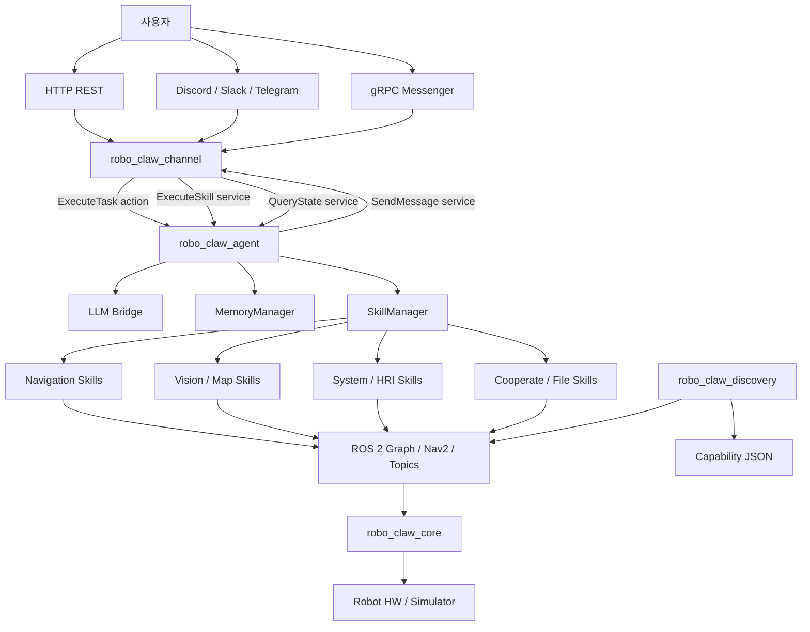
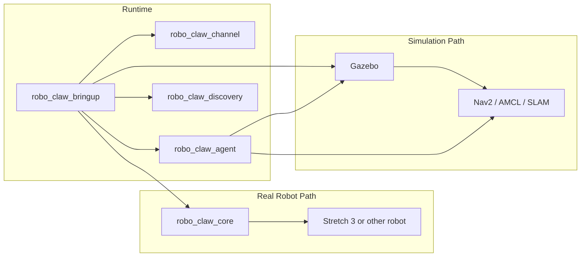

# RoboClaw 아키텍처

## 시스템 아키텍처

## 배포 관점 아키텍처

## 계층별 역할

| 계층 | 구성 요소 | 역할 |
| --- | --- | --- |
| 외부 인터페이스 | HTTP, gRPC, Discord, Slack, Telegram | 사용자 명령 수집 및 결과 전달 |
| 오케스트레이션 | `robo_claw_agent` | 문맥 수집, 계획 수립, 재플래닝, 실행 제어 |
| 실행 도구 | `SkillManager` + `skills/*` | 실제 로봇 기능 호출 |
| 기억/지식 | `MemoryManager` | 대화 기억, RAG, 시맨틱 위치 저장 |
| ROS 통합 | Nav2, 토픽, 서비스, 액션 | 로봇 제어와 센서 조회 |
| 하드웨어 계층 | `robo_claw_core` | 제어 루프, 센서 등록, 안전 정지 |
| 배포 조립 | `robo_claw_bringup`, `rc.sh` | 환경, 빌드, 런치 조합 |

## 해석 포인트

1. `robo_claw_channel`은 단순 API 서버가 아니라 모든 대외 채널을 통합하는 허브다.
2. `robo_claw_agent`는 중앙 두뇌이며, 직접 장치를 제어하기보다 스킬과 ROS 인터페이스를 조합한다.
3. `robo_claw_core`는 하드웨어 친화적 루프를 담당하고, `robo_claw_agent`는 추론과 계획을 담당한다.
4. gRPC와 ROS 인터페이스가 공존해 폐쇄망/외부망 양쪽 운영을 고려한 구조다.
