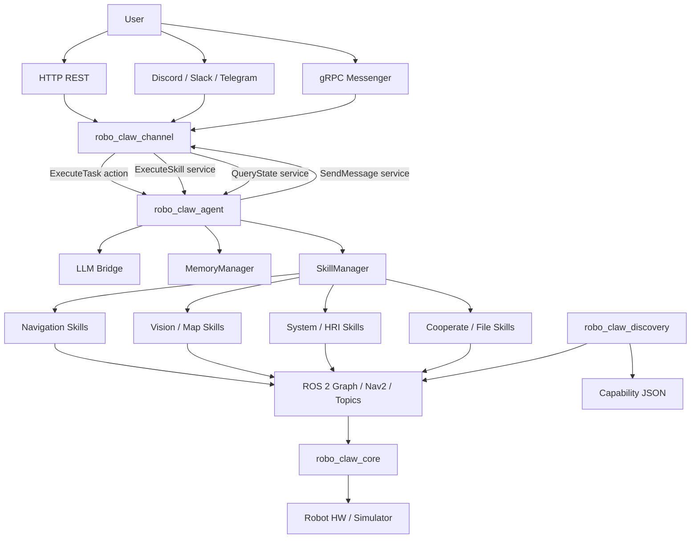
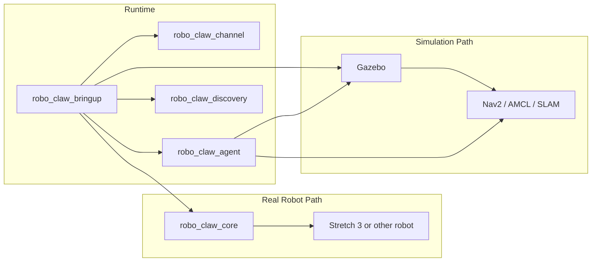

# RoboClaw Architecture

## System Architecture

## Deployment Architecture

## Layer Responsibilities

| Layer | Components | Role |
| --- | --- | --- |
| External Interface | HTTP, gRPC, Discord, Slack, Telegram | Collect user commands and deliver results |
| Orchestration | `robo_claw_agent` | Collect context, plan, replan, control execution |
| Execution Tools | `SkillManager` + `skills/*` | Invoke actual robot capabilities |
| Memory/Knowledge | `MemoryManager` | Store conversation memory, RAG data, semantic locations |
| ROS Integration | Nav2, topics, services, actions | Robot control and sensor queries |
| Hardware Layer | `robo_claw_core` | Control loop, sensor registration, safety stop |
| Deployment Assembly | `robo_claw_bringup`, `rc.sh` | Environment, build, and launch composition |

## Interpretation Points

1. `robo_claw_channel` is not just an API server. It is a hub that integrates all external channels.
2. `robo_claw_agent` is the central brain. It combines skills and ROS interfaces rather than directly controlling devices.
3. `robo_claw_core` handles the hardware-friendly loop, while `robo_claw_agent` handles inference and planning.
4. gRPC and ROS interfaces coexist, supporting both closed-network and external-network operation.
