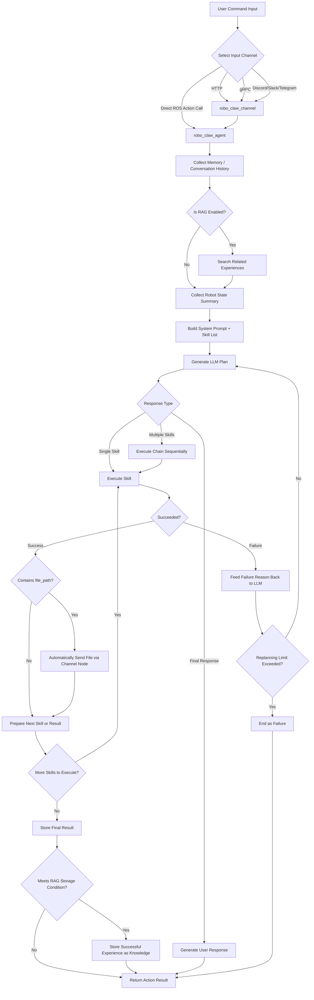
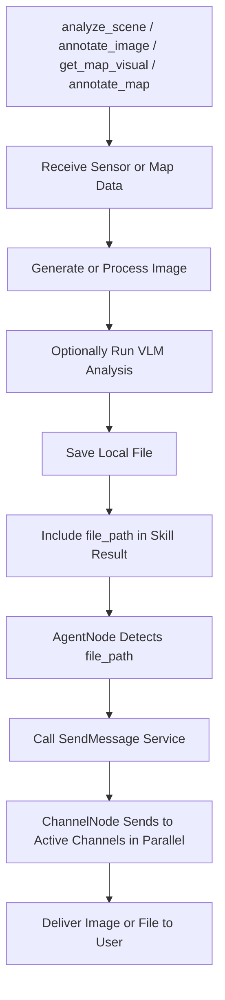
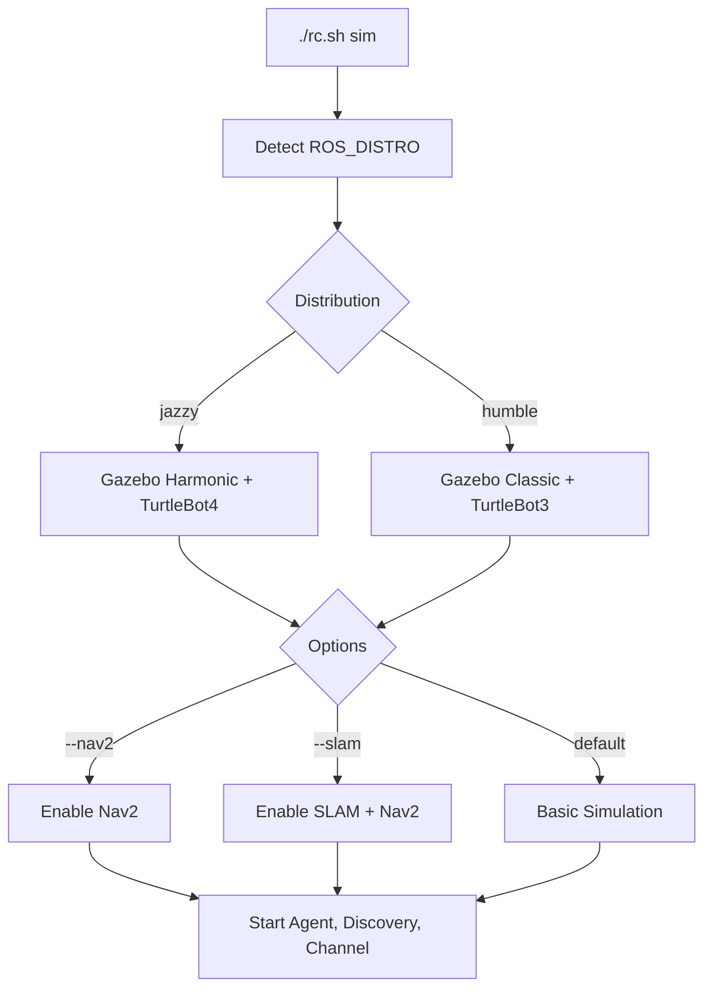

# RoboClaw Flowcharts

## Natural-Language Command Processing Flow

```mermaid
flowchart TD
    A[User Command Input] --> B{Select Input Channel}
    B -->|HTTP| C[robo_claw_channel]
    B -->|gRPC| C
    B -->|Discord/Slack/Telegram| C
    B -->|Direct ROS Action Call| D[robo_claw_agent]
    C --> D
    D --> E[Collect Memory / Conversation History]
    E --> F{Is RAG Enabled?}
    F -->|Yes| G[Search Related Experiences]
    F -->|No| H[Collect Robot State Summary]
    G --> H
    H --> I[Build System Prompt + Skill List]
    I --> J[Generate LLM Plan]
    J --> K{Response Type}
    K -->|Final Response| L[Generate User Response]
    K -->|Single Skill| M[Execute Skill]
    K -->|Multiple Skills| N[Execute Chain Sequentially]
    N --> M
    M --> O{Succeeded?}
    O -->|Failure| P[Feed Failure Reason Back to LLM]
    P --> Q{Replanning Limit Exceeded?}
    Q -->|No| J
    Q -->|Yes| R[End as Failure]
    O -->|Success| S{Contains file_path?}
    S -->|Yes| T[Automatically Send File via Channel Node]
    S -->|No| U[Prepare Next Skill or Result]
    T --> U
    U --> V{More Skills to Execute?}
    V -->|Yes| M
    V -->|No| W[Store Final Result]
    W --> X{Meets RAG Storage Condition?}
    X -->|Yes| Y[Store Successful Experience as Knowledge]
    X -->|No| Z[Return Action Result]
    Y --> Z
    L --> Z
    R --> Z
```

## Visual Output Generation and Automatic Delivery Flow

```mermaid
flowchart TD
    A[analyze_scene / annotate_image / get_map_visual / annotate_map] --> B[Receive Sensor or Map Data]
    B --> C[Generate or Process Image]
    C --> D[Optionally Run VLM Analysis]
    D --> E[Save Local File]
    E --> F[Include file_path in Skill Result]
    F --> G[AgentNode Detects file_path]
    G --> H[Call SendMessage Service]
    H --> I[ChannelNode Sends to Active Channels in Parallel]
    I --> J[Deliver Image or File to User]
```

## Simulation Launch Flow

```mermaid
flowchart TD
    A[./rc.sh sim] --> B[Detect ROS_DISTRO]
    B --> C{Distribution}
    C -->|jazzy| D[Gazebo Harmonic + TurtleBot4]
    C -->|humble| E[Gazebo Classic + TurtleBot3]
    D --> F{Options}
    E --> F
    F -->|--nav2| G[Enable Nav2]
    F -->|--slam| H[Enable SLAM + Nav2]
    F -->|default| I[Basic Simulation]
    G --> J[Start Agent, Discovery, Channel]
    H --> J
    I --> J
```
