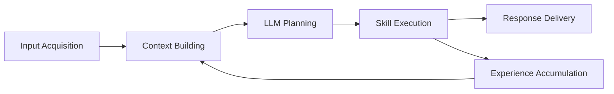

# RoboClaw Functional Architecture

## Functional Summary

From a functional perspective, RoboClaw can be described as a pipeline: "input acquisition -> context building -> plan generation -> skill execution -> result delivery -> experience accumulation."

## Functional Decomposition

| Functional Area | Detailed Function | Responsible Component |
| --- | --- | --- |
| User Input Acquisition | Receive HTTP requests | `robo_claw_channel.channel_node` |
| User Input Acquisition | Receive gRPC commands/streams | `robo_claw_channel.grpc_server` |
| User Input Acquisition | Receive Discord/Slack/Telegram messages | `robo_claw_channel.channels` |
| State/Context Collection | Query recent conversation history | `MemoryManager.get_conversation_history` |
| State/Context Collection | Search experience through RAG | `MemoryManager.search_knowledge` |
| State/Context Collection | Collect robot state summary | `GetStatusSkill.get_robot_summary` |
| Planning | Call LLM | `create_llm_bridge`, `BaseLLMBridge.chat` |
| Planning | Parse JSON plan | `AgentNode._parse_llm_response` |
| Execution Management | Load skills | `SkillManager.load_from_module` |
| Execution Management | Execute skills | `SkillManager.execute` |
| Navigation | Move to coordinate/semantic destination | `NavigateToSkill` |
| Navigation | Rotate/stop | `RotateSkill`, `StopSkill` |
| Perception | Measure lidar distance | `GetDistanceSkill` |
| Perception | Analyze/annotate scenes | `AnalyzeSceneSkill`, `AnnotateImageSkill` |
| Spatial Awareness | Map statistics/visualization/annotation | `AnalyzeMapSkill`, `GetMapVisualSkill`, `AnnotateMapSkill` |
| System | Emergency stop | `EmergencyStopSkill` |
| System | Execute restricted ROS CLI commands | `RosCommandSkill` |
| Cooperation | Delegate to another agent | `DelegateTaskSkill` |
| Delivery | Send messages/files to users | `SendMessageSkill`, `ChannelNode._handle_send_message` |
| Memory Accumulation | Store experience | `MemoryManager.add_knowledge` |
| Semantic Memory | Store place/object locations | `MemoryManager.add_object_location` |
| Hardware Control | Collect joint state | `HardwareInterface.on_joint_states` |
| Hardware Control | Publish base velocity | `HardwareInterface.write` |
| Deployment Assembly | Launch real robot/simulation | `robo_claw_bringup` |

## Functional Flow

## Responsibility Boundaries by Function

### 1. Interface Layer

Role:

- Convert external commands into standardized internal requests
- Deliver text and files back to users

Main components:

- `robo_claw_channel`
- `messenger.proto`
- HTTP `/task`, `/skill`, `/status`, `/health`

### 2. Intelligence Layer

Role:

- Summarize the current situation and create plans
- Replan based on failure results
- Execute skill chains step by step

Main components:

- `AgentNode`
- `llm_bridge`
- `SkillManager`

### 3. Memory Layer

Role:

- Maintain recent conversations and past successful experiences
- Preserve objects and places so they can be reused by name

Main components:

- `MemoryManager`

### 4. Capability Layer

Role:

- Provide the set of functions the robot can actually perform
- Execute domain-specific capabilities such as navigation, perception, visualization, safety, and messenger operations

Main components:

- `skills/*.py`

### 5. Runtime Layer

Role:

- Control sensors, joints, and velocity
- Connect real hardware or simulators through ROS interfaces

Main components:

- `robo_claw_core`
- Nav2
- Gazebo

## Meaning of This Structure

The Functional Architecture of this project is closer to an "actionable robot runtime" than a "conversational AI."

This matters for the following reasons.

1. Input, inference, and execution are clearly separated.
2. Adding a new channel or skill does not significantly change the central orchestration code.
3. The memory layer is not just a log. It is reused as input for future actions.
4. Visual result generation and user delivery are functionally connected into one pipeline.
