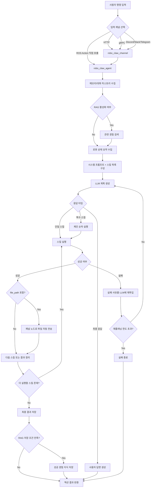
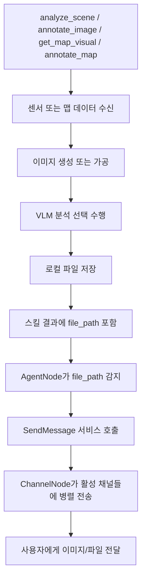
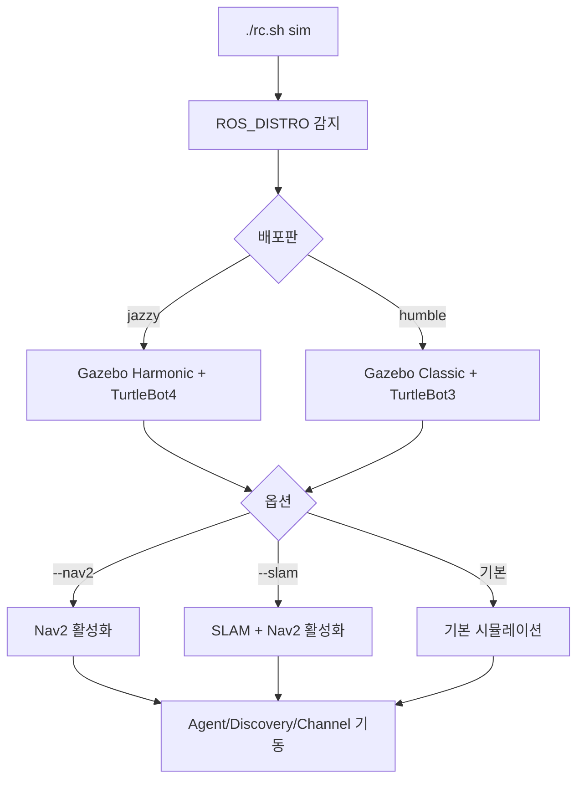

# RoboClaw 플로우차트

## 자연어 명령 처리 플로우

```mermaid
flowchart TD
    A[사용자 명령 입력] --> B{입력 채널 선택}
    B -->|HTTP| C[robo_claw_channel]
    B -->|gRPC| C
    B -->|Discord/Slack/Telegram| C
    B -->|ROS Action 직접 호출| D[robo_claw_agent]
    C --> D
    D --> E[메모리/대화 히스토리 수집]
    E --> F{RAG 활성화 여부}
    F -->|Yes| G[관련 경험 검색]
    F -->|No| H[로봇 상태 요약 수집]
    G --> H
    H --> I[시스템 프롬프트 + 스킬 목록 구성]
    I --> J[LLM 계획 생성]
    J --> K{응답 타입}
    K -->|최종 응답| L[사용자 답변 생성]
    K -->|단일 스킬| M[스킬 실행]
    K -->|복수 스킬| N[체인 순차 실행]
    N --> M
    M --> O{성공 여부}
    O -->|실패| P[실패 사유를 LLM에 재투입]
    P --> Q{재플래닝 한도 초과?}
    Q -->|No| J
    Q -->|Yes| R[실패 종료]
    O -->|성공| S{file_path 포함?}
    S -->|Yes| T[채널 노드로 파일 자동 전송]
    S -->|No| U[다음 스킬 또는 결과 정리]
    T --> U
    U --> V{더 실행할 스킬 존재?}
    V -->|Yes| M
    V -->|No| W[최종 결과 저장]
    W --> X{RAG 저장 조건 만족?}
    X -->|Yes| Y[성공 경험 지식 저장]
    X -->|No| Z[액션 결과 반환]
    Y --> Z
    L --> Z
    R --> Z
```

## 시각 결과물 생성 및 자동 전달 플로우

```mermaid
flowchart TD
    A[analyze_scene / annotate_image / get_map_visual / annotate_map] --> B[센서 또는 맵 데이터 수신]
    B --> C[이미지 생성 또는 가공]
    C --> D[VLM 분석 선택 수행]
    D --> E[로컬 파일 저장]
    E --> F[스킬 결과에 file_path 포함]
    F --> G[AgentNode가 file_path 감지]
    G --> H[SendMessage 서비스 호출]
    H --> I[ChannelNode가 활성 채널들에 병렬 전송]
    I --> J[사용자에게 이미지/파일 전달]
```

## 시뮬레이션 런치 플로우

```mermaid
flowchart TD
    A[./rc.sh sim] --> B[ROS_DISTRO 감지]
    B --> C{배포판}
    C -->|jazzy| D[Gazebo Harmonic + TurtleBot4]
    C -->|humble| E[Gazebo Classic + TurtleBot3]
    D --> F{옵션}
    E --> F
    F -->|--nav2| G[Nav2 활성화]
    F -->|--slam| H[SLAM + Nav2 활성화]
    F -->|기본| I[기본 시뮬레이션]
    G --> J[Agent/Discovery/Channel 기동]
    H --> J
    I --> J
```
