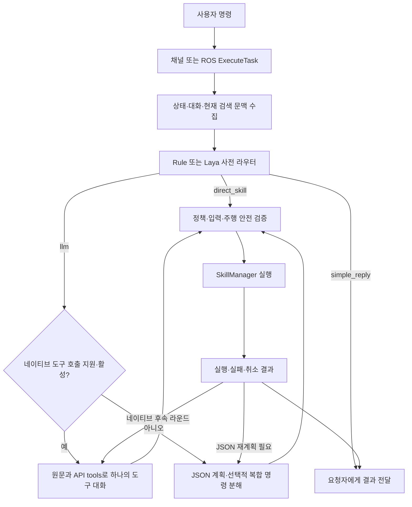
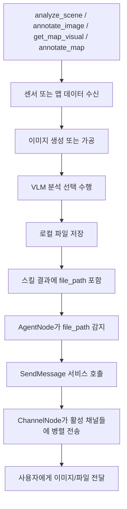
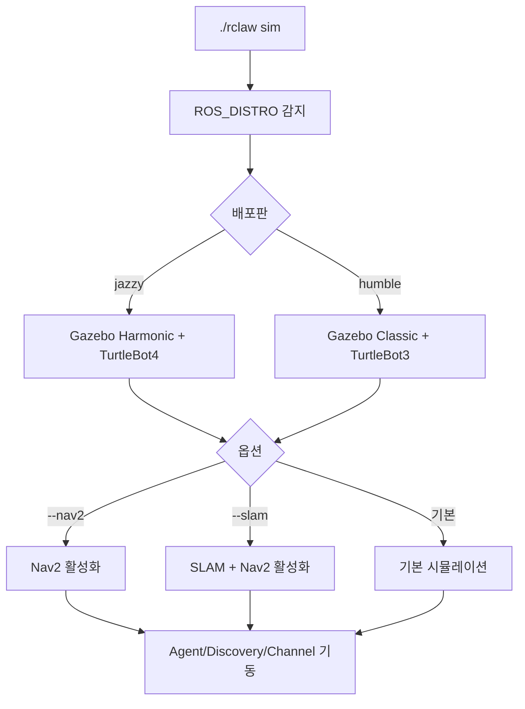

# 요청과 결과 전달 흐름

이 문서는 자연어 요청의 분기와 시각 결과물 전달·시뮬레이션 기동 경로를 설명합니다.
기본 네이티브 도구 호출과 JSON 계획 경로를 구분합니다.

## 자연어 명령 처리 플로우

```mermaid
flowchart TD
    A[사용자 명령] --> B[채널 또는 ROS ExecuteTask]
    B --> C[상태·대화·현재 검색 문맥 수집]
    C --> R[Rule 또는 Laya 사전 라우터]
    R -->|direct_skill| V[정책·입력·주행 안전 검증]
    R -->|simple_reply| Z[요청자에게 결과 전달]
    R -->|llm| T{네이티브 도구 호출 지원·활성?}
    T -->|예| N[원문과 API tools로 하나의 도구 대화]
    T -->|아니오| J[JSON 계획·선택적 복합 명령 분해]
    N --> V
    J --> V
    V --> E[SkillManager 실행]
    E --> F[실행·실패·취소 결과]
    F -->|네이티브 후속 라운드| N
    F -->|JSON 재계획 필요| J
    F --> Z
```

## 시각 결과물 생성 및 자동 전달 플로우

```mermaid
flowchart TD
    A[analyze_scene / annotate_image / get_map_visual / annotate_map] --> B[센서 또는 맵 데이터 수신]
    B --> C[이미지 생성 또는 가공]
    C --> D[VLM 분석 선택 수행]
    D --> E[로컬 파일 저장]
    E --> F[스킬 결과에 file_path 포함]
    F --> G[AgentNode가 file_path 감지]
    G --> H[SendMessage 서비스 호출]
    H --> I[ChannelNode가 활성 채널들에 병렬 전송]
    I --> J[사용자에게 이미지/파일 전달]
```

## 시뮬레이션 런치 플로우

```mermaid
flowchart TD
    A[./rclaw sim] --> B[ROS_DISTRO 감지]
    B --> C{배포판}
    C -->|jazzy| D[Gazebo Harmonic + TurtleBot4]
    C -->|humble| E[Gazebo Classic + TurtleBot3]
    D --> F{옵션}
    E --> F
    F -->|--nav2| G[Nav2 활성화]
    F -->|--slam| H[SLAM + Nav2 활성화]
    F -->|기본| I[기본 시뮬레이션]
    G --> J[Agent/Discovery/Channel 기동]
    H --> J
    I --> J
```
