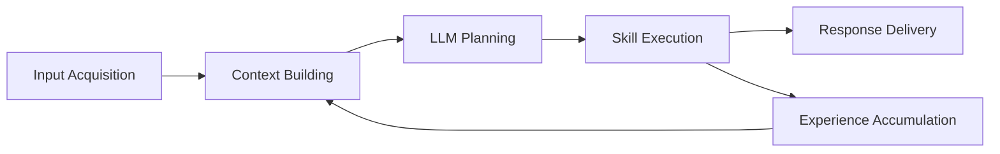

# RoboClaw Functional Architecture

## 기능 관점 요약

RoboClaw를 기능 관점에서 보면 "입력 수집 -> 문맥 형성 -> 계획 생성 -> 스킬 실행 -> 결과 전달 -> 경험 축적"의 파이프라인으로 설명할 수 있다.

## 기능 분해

| 기능 영역 | 세부 기능 | 담당 컴포넌트 |
| --- | --- | --- |
| 사용자 입력 수집 | HTTP 요청 수신 | `robo_claw_channel.channel_node` |
| 사용자 입력 수집 | gRPC 명령/스트림 수신 | `robo_claw_channel.grpc_server` |
| 사용자 입력 수집 | Discord/Slack/Telegram 수신 | `robo_claw_channel.channels` |
| 상태/문맥 수집 | 최근 대화 이력 조회 | `MemoryManager.get_conversation_history` |
| 상태/문맥 수집 | 경험 검색(RAG) | `MemoryManager.search_knowledge` |
| 상태/문맥 수집 | 로봇 상태 요약 수집 | `GetStatusSkill.get_robot_summary` |
| 계획 수립 | LLM 호출 | `create_llm_bridge`, `BaseLLMBridge.chat` |
| 계획 수립 | JSON 계획 해석 | `AgentNode._parse_llm_response` |
| 실행 관리 | 스킬 로드 | `SkillManager.load_from_module` |
| 실행 관리 | 스킬 실행 | `SkillManager.execute` |
| 이동 기능 | 좌표/시맨틱 목적지 이동 | `NavigateToSkill` |
| 이동 기능 | 회전/정지 | `RotateSkill`, `StopSkill` |
| 인식 기능 | 라이다 거리 측정 | `GetDistanceSkill` |
| 인식 기능 | 장면 분석/마킹 | `AnalyzeSceneSkill`, `AnnotateImageSkill` |
| 공간 인지 | 맵 통계/시각화/마킹 | `AnalyzeMapSkill`, `GetMapVisualSkill`, `AnnotateMapSkill` |
| 시스템 기능 | 비상 정지 | `EmergencyStopSkill` |
| 시스템 기능 | 제한된 ROS CLI 실행 | `RosCommandSkill` |
| 협업 기능 | 타 에이전트 위임 | `DelegateTaskSkill` |
| 전달 기능 | 메시지/파일 사용자 전송 | `SendMessageSkill`, `ChannelNode._handle_send_message` |
| 기억 축적 | 경험 저장 | `MemoryManager.add_knowledge` |
| 시맨틱 기억 | 장소/객체 위치 저장 | `MemoryManager.add_object_location` |
| 하드웨어 제어 | 조인트 상태 수집 | `HardwareInterface.on_joint_states` |
| 하드웨어 제어 | 베이스 속도 발행 | `HardwareInterface.write` |
| 배포 조립 | 실기/시뮬레이션 런치 | `robo_claw_bringup` |

## 기능 흐름도

## 기능별 책임 경계

### 1. Interface Layer

역할:

- 외부 명령을 표준화된 내부 요청으로 변환
- 사용자에게 텍스트와 파일을 다시 전달

주요 컴포넌트:

- `robo_claw_channel`
- `messenger.proto`
- HTTP `/task`, `/skill`, `/status`, `/health`

### 2. Intelligence Layer

역할:

- 현재 상황을 요약하고 계획 수립
- 실패 결과를 바탕으로 재플래닝
- 스킬 체인을 단계적으로 실행

주요 컴포넌트:

- `AgentNode`
- `llm_bridge`
- `SkillManager`

### 3. Memory Layer

역할:

- 최근 대화와 과거 성공 경험 유지
- 객체와 장소를 이름 기반으로 재사용 가능하게 보존

주요 컴포넌트:

- `MemoryManager`

### 4. Capability Layer

역할:

- 로봇이 실제로 수행할 기능 집합 제공
- 내비게이션, 인식, 시각화, 안전, 메신저 등 도메인별 실행 담당

주요 컴포넌트:

- `skills/*.py`

### 5. Runtime Layer

역할:

- 센서/조인트/속도 제어
- 실제 하드웨어 또는 시뮬레이터와 ROS 인터페이스 연결

주요 컴포넌트:

- `robo_claw_core`
- Nav2
- Gazebo

## 이 구조의 의미

이 프로젝트의 Functional Architecture는 "대화형 AI"보다 "행동 가능한 로봇 런타임"에 가깝다.

중요한 이유는 아래와 같다.

1. 입력과 추론과 실행이 명확히 분리되어 있다.
2. 새 채널이나 새 스킬을 추가해도 중심 오케스트레이션 코드는 크게 바뀌지 않는다.
3. 기억 계층이 단순 로그가 아니라 다음 행동의 입력으로 다시 쓰인다.
4. 시각 결과물 생성과 사용자 전달이 기능적으로 한 파이프라인으로 연결돼 있다.
